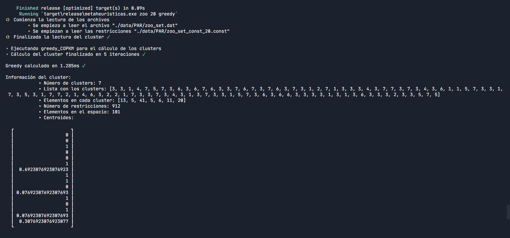
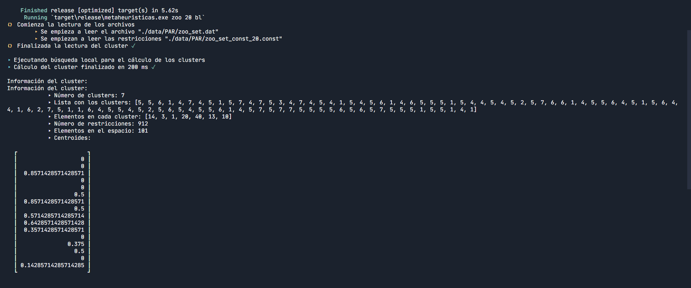
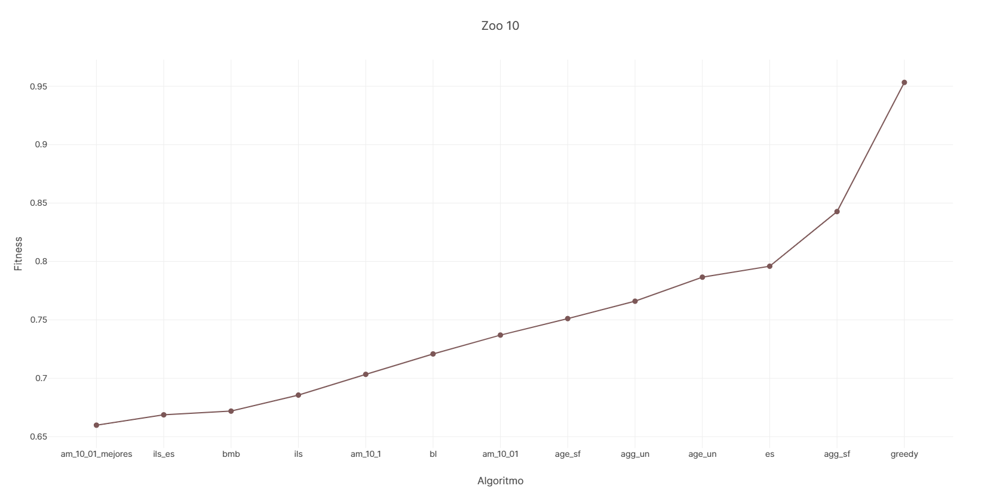
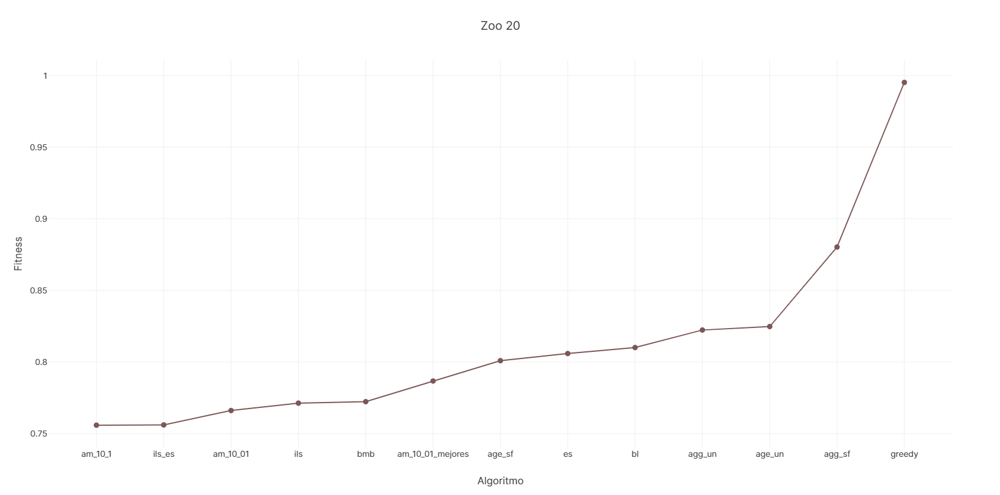
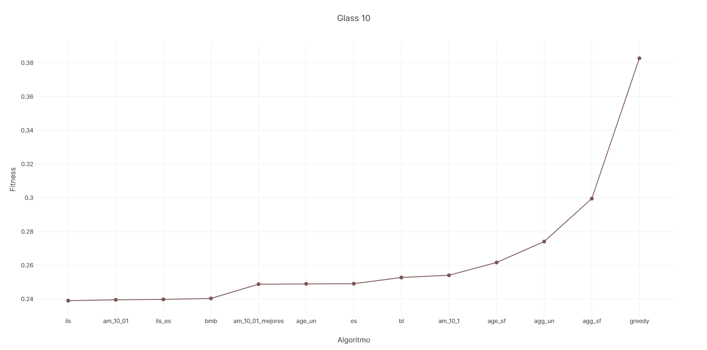
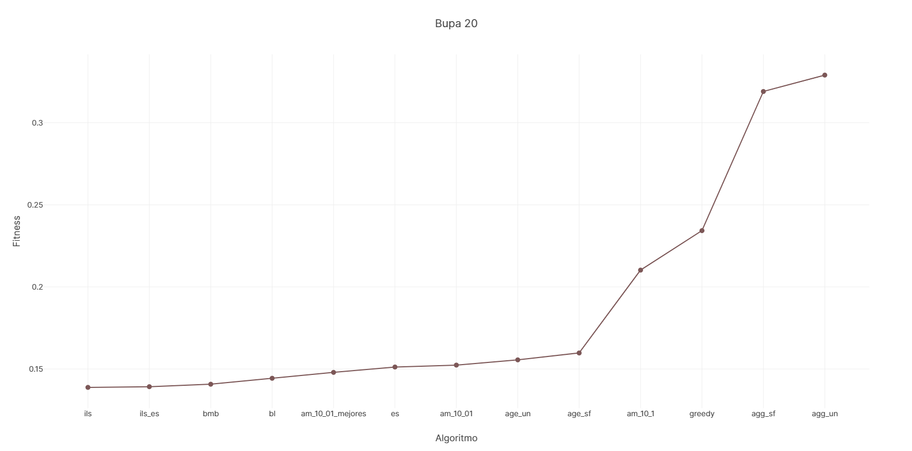

# Algoritmos para resolver el problema de agrupación con restricciones


> **Autor**: Andrés Millán
> **DNI**:
> **Email**: amilmun@correo.ugr.es
> **Grupo de prácticas**: MH3

# Tabla de contenidos

- [Sobre esta memoria](#sobre-esta-memoria)
    - [Benchmark de uno o más algoritmos](#benchmark-de-uno-o-más-algoritmos)
    - [Ejecutar uno o varios algoritmos para un dataset en particular](#ejecutar-uno-o-varios-algoritmos-para-un-dataset-en-particular)
    - [Analizar los archivos `.csv`](#analizar-los-archivos-csv)
- [Descripción del problema](#descripción-del-problema)
- [Procedimiento seguido para resolver la práctica](#procedimiento-seguido-para-resolver-la-práctica)
  - [Crates usadas](#crates-usadas)
  - [Estructura del programa](#estructura-del-programa)
  - [La clase `Clusters`](#la-clase-clusters)
    - [Sobre las dimensiones](#sobre-las-dimensiones)
    - [Elementos del espacio](#elementos-del-espacio)
    - [Representación de las soluciones](#representación-de-las-soluciones)
    - [Restricciones](#restricciones)
    - [Estadísticos](#estadísticos)
      - [Infeasibility](#infeasibility)
      - [Fitness](#fitness)
  - [Semillas](#semillas)
- [Práctica 1: Greedy K-medias y búsqueda local](#práctica-1-greedy-k-medias-y-búsqueda-local)
  - [Greedy](#greedy)
    - [Descripción del algoritmo](#descripción-del-algoritmo)
  - [Búsqueda local](#búsqueda-local)
    - [Descripción del algoritmo](#descripción-del-algoritmo-1)
    - [Implementación](#implementación)
- [Práctica 2: algoritmos genéticos y meméticos](#práctica-2-algoritmos-genéticos-y-meméticos)
  - [Conceptos básicos de los algoritmos genéticos y meméticos](#conceptos-básicos-de-los-algoritmos-genéticos-y-meméticos)
  - [Operadores](#operadores)
    - [Operadores de selección](#operadores-de-selección)
    - [Operadores de cruce](#operadores-de-cruce)
      - [Cruce uniforme](#cruce-uniforme)
      - [Cruce de segmento fijo](#cruce-de-segmento-fijo)
    - [Operadores de mutación](#operadores-de-mutación)
  - [Otras consideraciones](#otras-consideraciones)
    - [Reparación](#reparación)
    - [Generación aleatoria de la población inicial](#generación-aleatoria-de-la-población-inicial)
  - [Algoritmos genéticos considerados](#algoritmos-genéticos-considerados)
    - [Esquemas de reemplazamiento](#esquemas-de-reemplazamiento)
    - [Implementación](#implementación-1)
  - [Algoritmos meméticos](#algoritmos-meméticos)
    - [Búsqueda local suave](#búsqueda-local-suave)
    - [Implementación](#implementación-2)
- [Práctica 3: equilibrando diversificación e intensificación](#práctica-3-equilibrando-diversificación-e-intensificación)
  - [Enfriamiento simulado](#enfriamiento-simulado)
    - [Generación de vecinos](#generación-de-vecinos)
    - [Esquema de enfriamiento](#esquema-de-enfriamiento)
    - [Pseudocódigo](#pseudocódigo)
  - [Búsqueda multiarranque básica](#búsqueda-multiarranque-básica)
  - [Búsqueda local reiterada](#búsqueda-local-reiterada)
    - [Operador de mutación del ILS](#operador-de-mutación-del-ils)
    - [Pseudocódigo](#pseudocódigo-1)
  - [Híbrido de Busqueda local reiterada con enfriamiento simulado](#híbrido-de-busqueda-local-reiterada-con-enfriamiento-simulado)
- [Análisis de resultados](#análisis-de-resultados)
  - [Descripción de los casos del problema empleados](#descripción-de-los-casos-del-problema-empleados)
  - [Benchmarking y resultados obtenidos](#benchmarking-y-resultados-obtenidos)
  - [Resultados de cada dataset](#resultados-de-cada-dataset)
    - [Zoo 10](#zoo-10)
    - [Zoo 20](#zoo-20)
    - [Glass 10](#glass-10)
    - [Glass 20](#glass-20)
    - [Bupa 10](#bupa-10)
    - [Bupa 20](#bupa-20)
  - [Síntesis](#síntesis)
    - [Los algoritmos de la práctica 3](#los-algoritmos-de-la-práctica-3)
    - [Sobre los genéticos](#sobre-los-genéticos)
    - [Algoritmos meméticos](#algoritmos-meméticos-1)
    - [Dejándonos llevar por la corriente](#dejándonos-llevar-por-la-corriente)
    - [Conclusiones](#conclusiones)
- [Referencias](#referencias)


* * *


## Sobre esta memoria

En esta memoria se recoge toda la información necesaria para resolver el problema del **agrupamiento con restricciones**, así como la documentación y el desarrollo de las prácticas de la asignatura Metaheurísticas.

Todo el código está subido en el repositorio de Github https://github.com/Asmilex/Metaheuristicas. Para ejecutarlo, es necesario [tener instalado Rust](https://www.rust-lang.org/tools/install). El comprimido de la entrega contendrá los mismos archivos que se encuentran en el repositorio. El único cambio será la fecha de la versión y la localización del PDF generado a partir de este archivo.

Se puede compilar y correr el proyecto con `cargo run --release`. Sin embargo, es necesario especificar ciertos parámetros de entrada, que dependerán de lo que se quiera hacer. Estas son las posibilidades:

#### Benchmark de uno o más algoritmos

Escribir en la línea de comandos `cargo run --release benchmark [algoritmos]`. donde `[algoritmos]` son uno o más elementos de la siguiente lista:
- `greedy`.
- `bl`.
- Algoritmos genéticos
  - Se puede introducir `geneticos` para ejecutarlos todos.
  - Alternativamente, se pueden especificar a mano: `agg_un`, `agg_sf`, `age_un` o `age_sf`.
- Algoritmos meméticos:
  - Usando `memeticos` se ejecutarán todos los de esta categoría descritos en esta documentación
  - Alternativamente, se pueden especificar a mano: `am_10_1`, `am_10_01`, `am_10_01_mejores`.
- Para los algoritmos de la práctica 3, los parámetros de ejecución son:
  - `es` para enfriamiento simulado, `bmb` para la búsqueda multiarranque básica, `ils` para la búsqueda local reiterada, y `ils-es` para el híbrido entre estas dos últimas.
  - `p3` si se quieren ejecutar todos.

Si no se especifica ninguno, se usarán todos. Cada algoritmo se ejecuta 5 veces por dataset (por lo que cada uno se realiza 30 veces). La información resultante se exportará al archivo `./data/csv/[dataset]_[número de restricciones]/[nombre del algoritmo].csv`, el cual contendrá las medidas necesarias para el posterior análisis que realizaremos. Por ejemplo, un archivo sería `/data/csv/bupa_10/age_sf.csv`.

Tras ejecutar esta opción, se analizarán automáticamente los resultados, produciendo los archivos correspondientes indicados en la sección [Analizar los archivos csv](#analizar-los-archivos-csv).

#### Ejecutar uno o varios algoritmos para un dataset en particular

Para ejecutar un único algoritmo para un cierto dataset, se debe introducir en la línea de comandos `cargo run --release [dataset] {10, 20} [algoritmos]`, donde `[dataset]` puede valer `bupa`, `glass` o `zoo`, eligiendo qué conjunto de restricciones usar (`10` o `20`). La lista de algoritmos funciona de la misma manera que en el apartado anterior.

Este modo resulta cómodo a la hora de comprobar el funcionamiento de un algoritmo en concreto, y verificar que se ejecuta correctamente.

#### Analizar los archivos `.csv`

Una vez se hayan ejecutado los benchmarks correspondientes, se puede extraer automáticamente la información de los resultados. Para ello, se debe introducir `cargo run --release analyze`. Esto exportará un archivo llamado `analisis.csv` en las carpetas de los datasets con la media de cada algoritmo.


* * *


## Descripción del problema

A lo largo de estas prácticas se resolverá el problema del **agrupamiento con restricciones**. Este es una modificación del clásico problema del *clustering*, el cual se describe de la siguiente forma:

Se nos presenta una lista de elementos con un cierto número de atributos. Los representaremos como vectores en $[0, 1]^d$. Debemos agruparlos en un cierto número de categorías, llamados **clústers**, de forma que se minimice la distancia entre estos vectores.

Nuestro matiz consiste en que les pondremos restricciones a los elementos a analizar. De esta forma, forzaremos a que dos vectores deban localizarse en en mismo clúster, o lo contrario; que deban estar en clústers distintos. Por tanto, no solo debemos conseguir una denominada *distancia intraclúster* baja, sino que se debe violar el mínimo número de restricciones posibles.

Durante estas prácticas propondremos diferentes algoritmos para resolver este problema.

En la práctica 1, presentaremos soluciones sencillas basadas en algoritmos simples como [**Greedy** o **Búsqueda Local**](#práctica-1-greedy-k-medias-y-búsqueda-local).

En la práctica 2, la cual es la que vamos a tratar, implementaremos algunas versiones de los [algoritmos **genéticos** y **meméticos**](#práctica-2-algoritmos-genéticos-y-meméticos).

Finalmente, la práctica 3 presenta varios algoritmos que se encargan de equilibrar intensificación y exploración. Estos son: **enfriamiento simulado**, **búsqueda multiarranque básica**, **búsqueda local reiterada**, y un **híbrido entre las dos últimas**.


* * *


## Procedimiento seguido para resolver la práctica

Todo el código está escrito en **Rust**. Es un lenguaje moderno, eficiente y fiable en cuestiones relativas a accesos a memoria. Su elección ha sido puro interés personal.


### Crates usadas

Para facilitar la implementación, se han utilizado una serie de *crates* (nombre que reciben las librerías por parte de los *rustáceos*). Estas son:
- [Naglebra](https://www.nalgebra.org/): una librería de álgebra lineal. Utilizada para operaciones con matrices y vectores.
- [Rand](https://docs.rs/rand/0.8.3/rand/): para los generadores de números aleatorios.
- [Multimap](https://docs.rs/multimap/0.8.3/multimap/index.html): para el almacenamiento eficiente de las listas de restricciones.
- [Csv](https://docs.rs/csv/1.1.6/csv/): para exportar los resultados a `.csv`.
- [Serde](https://serde.rs/): Para facilitar el análisis de resultados. Me permite leer fácilmente los archivos `.csv`.
- [Colored](https://docs.rs/colored/2.0.0/colored/): para hacer más bonitas y legibles las salidas a consola.


### Estructura del programa

Se han dividido las funcionalidades clave del programa en distintos ficheros. Estos son:
- `main.rs`: contiene el código relacionado con la realización de una ejecución simple y de un benchmark, así como el *parseo* de argumentos.
- `file_io.rs`: aquí se ubican las funciones relacionadas con entrada/salida de archivos. En particular, la lectura de los ficheros de restricciones y la salida a los archivos csv.
- `utils.rs`: se definen las diferentes estructuras relacionadas con el problema. Por ejemplo, `ParametrosDataset` agrupa los datos necesarios para operar un cierto dataset.
- `algorithm.rs`: todos los algoritmos implementados se encuentran aquí.
- `cluster.rs`: las principales estructuras necesarias para resolver el problema se localizan en este fichero. Específicamente, la clase `Clusters`. Estudiaremos a fondo sus elementos.
- `operator.rs`: en este fichero se definen e implementan los operadores utilizados a partir de la práctica 2.


### La clase `Clusters`

Esta estructura supondrá el grueso de nuestro programa. *Agrupará* toda la información pertinente a la resolución del problema. En las siguientes secciones, describiremos sus elementos. No obstante, omitiremos las funciones de poco interés didáctico


#### Sobre las dimensiones

Necesitaremos tres medidas para generar una solución:

- `num_clusters` representa el número de clústers fijado por el problema.
- `dim_vectores` es el número de atributos del dataset.
- `num_elementos` es el número de vectores o muestras del dataset.


#### Elementos del espacio

La clase conoce en todo momento el conjunto de elementos del dataset que estamos tratando, así como sus distancias respectivas. Los miembros que se encargan de guardar esta información son `espacio` y `distancias` respectivamente. El cálculo de la variable $\lambda$, de la cual hablaremos más tarde, se guarda cuál es el máximo de las distancias al calcular la matriz `distancias`.

Para almacenar los vectores, hemos utilizado un vector de `Nalgebra::DVector`, un tipo de array dinámico con funciones de álgebra lineal. Esto nos será de gran ayuda, pues simplificará las operaciones del espacio vectorial con el que tratamos.


#### Representación de las soluciones

Las soluciones se representan con una lista de enteros, `lista_clusters`, de forma que, para una cierta entrada $i$ de dicha lista:
- Si su valor es $0$, entonces, ese elemento no tiene clúster asignado
- En otro caso, su valor está en el conjunto $\{1, ..., num\_clusters\}$.

Una solución solo se considerará válida si todo clúster tiene al menos un elemento asignado. Si algún elemento ha modificado su clúster, la clase automáticamente lo registra en la estructura `recuento_clusters`, por lo que nos resultará sencillo comprobar cuántos elementos hay en cada uno.


#### Restricciones

Representaremos las restricciones de dos formas distintas:
1. La primera de ellas es mediante una matriz dinámica de *Nalgebra* (`restricciones`) con entradas que toman valores en $\{0, 1, -1\}$. Para una cierta entrada $[(i, j)]$, si su valor es $0$, no hay ninguna restricción aplicada del vector con posición $i$ y el vector $j$. Si es $1$, entonces es una restricción del tipo `Must-Link`; esto es, deben ir agrupadas en el mismo clúster. Si su entrada es $-1$, ocurre lo contrario al caso anterior: estos dos vectores tienen una restricción del tipo `Cannot-Link`, y deben ir en clústers distintos. Esta estructura de datos nos resultará útil cuando queramos calcular el infeasibility de todo el sistema.
2. La segunda es un *hashmap* para cada tipo de restricción. Dado un cierto índice $i$, los hashmaps `restricciones_ML` y `restricciones_CL` devuelven todos los índices con los que tienen restricciones. Aceleran muchísimo el cálculo del infeasibility generado por la asignación de un clúster a un cierto elemento.

El número de restricciones se guarda al crear la matriz de restricciones.


#### Estadísticos

El interés de este problema reside en ser capaces de crear clústers lo más verosímiles posibles entre sí. Por tanto, para determinar cómo de buena es una solución, necesitamos algún tipo de estadístico que nos informe de ello. Debido a la naturaleza del problema, vamos a considerar dos: El **infeasibility** y el **fitness**.
- **Infeasiblity** es una medida de cuántas restricciones han sido violadas en conjunto; es decir, cuántos elementos con restricción *Cannot-Link* han caído en el mismo clúster, y cuántos vectores con restricción del tipo *Must-Link* se encuentran en clústers separados. La función `infeasibility()` nos permite conocer esto.
Sin embargo, no siempre nos interesa saber cuál es el estado de todo el sistema, sino cómo de malo sería meter un elemento en un cierto clúster. Para esto sirve la función `infeasibility_esperada(indice, clúster)`. Es una forma mucho más rápida de comprobar incrementos y decrementos en el sistema.
- En este problema, tanto las restricciones incumplidas como la distancia entre los elementos son importantes. Por ello, el **fitness** considera ambas. Éste se define de la siguiente manera:
$$
\text{fitness} = \text{desviación general de la partición} + \lambda \cdot \text{infeasiblity}
$$
donde la desviación general de la partición es la media de la suma de las distancias medias intraclúster, y $\lambda$ se define como el cociente entre el máximo de las distancias en el sistema y el número de restricciones totales del sistema. Se puede conocer gracias a la función `fitness()`.

El pseudocódigo de las funciones que calculan estos valores es el siguiente:

##### Infeasibility

```
infeasibility():
    infeasibility = 0
    M = Matriz de restricciones
    n = tamaño de la matriz de restricciones

    Para i en 0 .. n
        Para j en 0 .. n
            Si M[i, j] == 1
                Si solucion[i] != solucion[j]
                    infeasibility++
            Si M[i, j] == -1
                Si solucion[i] == solucion[j]
                    infeasibility++

    infeasibility
```

##### Fitness

```
fitness():
    desviacion_general_particion + lambda() * infeasibility()
```


### Semillas

Dado que todos los métodos de resolución que programemos requieren aleatoriedad, fijaremos unas semillas para todos los generadores del programas. Se encuentran almacenadas en la clase `utils.rs/Semillas`. Estas son: `328471273`, `1821789317287`, `128931083781`, `1802783721873`, `9584985309`. El generador usado es el que recomienda la documentación del crate `rand`: `StdRng`. El algoritmo que utiliza es el Chacha block cipher de 12 rondas.


* * *

## Práctica 1: Greedy K-medias y búsqueda local

### Greedy

El algoritmo **Greedy K-medias aplicado a clustering con restricciones** es capaz de proporcionarnos una solución relativamente buena en muy pocos milisegundos. Su implementación es muy sencilla, así como la idea que hay tras éste.

#### Descripción del algoritmo

Partiendo de un clúster vacío, pero con todos los elementos cargados, consideramos una serie de centroides aleatorios, tantos como número de clústers debamos generar. Recorremos los elementos del espacio de forma aleatoria, de manera que asignamos cada uno al clúster en el que menor número de restricciones se viola (esto es, de menor infeasibility). En caso de empate, se asigna al clúster con centroide más cercano a nuestro punto, entendiendo por cercano a aquel centroide que minimiza la distancia euclidiana. Se actualizan los centroides, y se repite todo hasta que la solución se estabilice.

El pseudocódigo, por tanto, quedaría así:

```
Greedy_COPKM

1. Generar centroides aleatorios con distribución uniforme en R^d.
2. Barajar los índices de forma aleatoria y sin repetición.
3. Mientras se produzcan cambios en el clúster:
  3.1. Para cada índice, mirar qué incremento supone en la infeasibility al asignarlo a un clúster. Tomar el menor de estos.
  3.2. Actualizar los centroides
```



En la sección [Análisis de resultados](#análisis-de-resultados) comprobaremos cómo de buena es la solución obtenida.


* * *


### Búsqueda local

**Búsqueda local** es la primera metaheurística que programaremos. Aunque es un algoritmo conceptualmente sencillo, supone una mejora en ciertos aspectos con respecto a Greedy. Se basa en la exploración de vecinos a la solución actual, tomando el mejor de entre los posibles. Por su naturaleza, suele generar óptimos locales.


#### Descripción del algoritmo

Como hemos citado, se exploran los vecinos de una cierta solución, mirando en cada iteración cuáles son las mejores soluciones. Se define un vecino como la asignación de clúster $c$ al $i-ésimo$ elemento del espacio partiendo de una solución actual. Debemos verificar que la posible solución generada con este operador es válida, pues en otro caso, no tiene sentido seguir.

El concepto de *mejor solución* es el que proporciona el fitness. Es decir, en cada iteración, se comprobará si el vecino tiene un fitness menor que el actual. Si es así, la siguiente solución a explorar será esta.

#### Implementación

El pseudocódigo del algoritmo es el siguiente:

```
busqueda_local():
    Generar una solución válida inicial.

    Hasta que no se haya alcanzado un óptimo local
        Guardar la información de la solución actual relevante: fitness, infeasibility,
        Barajar los índices {0, ..., num_elementos}

        Para i en los índices barajados
            Barajar los clústers {1, ..., num_clusters}

            Para c en los clústers barajados
                Si el clúster del i-ésimo elemento no es c
                   Comprobar si el vecino nuevo es válido
                   En ese caso, comprobar si tiene un fitness menor.
                Si es así, reexplorar todos los índices de nuevo y actualizar la información de la solución nueva.

           Si se ha encontrado una nueva solución, ignorar el resto de índices.
```

Las operaciones más relevantes de este algoritmo las realizamos en la función `bl_fitness_posible_sol(i, c, antiguo_infeasibility)`. Por cómo está gestionado internamente el clúster, es mucho más rápido verificar que la solución es válida dentro del propio clúster, y no fuera. Esta función se encarga de asignar temporalmente el vecino, comprobar si es válido, y en caso de serlo, devolver qué fitness produciría. El motivo de que necesite el antiguo infeasibility es por eficiencia. En vez de calcular todo el sistema para cada vecino nuevo, se calcula de la siguiente manera:
$$
\text{Infeasibility nuevo} = (\text{infeasibility antiguo})  - (\text{infeasilibity producido por el cluster antiguo para el vector i}) + (\text{infeasibility producido por el nuevo cluster c para el vector i})
$$

Como mencionamos en uno de los apartados anteriores, el cálculo de esta delta es muchísimo más rápido que el de todo el sistema. En la siguiente sección comprobaremos cuánto tarda en total un benchmark.




* * *


## Práctica 2: algoritmos genéticos y meméticos

### Conceptos básicos de los algoritmos genéticos y meméticos

En esta segunda práctica, realizaremos una versión adaptada de los algoritmos **genéticos** y **meméticos**. Los meméticos tienen como base un algoritmo genético al que se le introduce una fase de mejora de las soluciones cada ciertas generaciones. Por tanto, presentaremos primero los conceptos básicos para ambos.

Los genéticos introducen un conjunto de soluciones llamadas **cromosomas**. Cada componente de un cromosoma se denomina **gen**. Al conjunto de todos los cromosomas se le conoce como **población**.

La idea de estos algoritmos es que los cromosomas evolucionan, de forma que cada **generación** produce unos descendientes atendiendo a una serie de pasos ordenados: **selección**, **cruce**, **mutación** y **reemplazamiento**.

La forma en la que se realizan estas fases se define mediante los **operadores**.


### Operadores

Los operadores son funciones que reciben una o dos soluciones y producen otra. Cada paso tiene su operador específico, y todos poseen algún componente de aleatoriedad.

En la implementación, únicamente los operadores de cruce se han separado. El resto se encuentran incrustados en el código del algoritmo genético principal.

#### Operadores de selección

El operador de selección será un **torneo binario**. Enfrentaremos dos cromosomas para ver quién tiene mejor fitness, y nos quedaremos con ese.

La selección tendrá un componente de aleatoriedad en todos los algoritmos genéticos. Elegiremos cierto número de cromosomas dependiendo del modelo en el que nos encontremos, y los emparejaremos al azar. Esto implica que un cromosoma podría elegirse más de una vez.

El pseudocódigo es el siguiente:

```
operador de selección(p1, p2):
    Si fitness(p1) < fitness(p2)
        p1
    En otro caso
        p2
```

#### Operadores de cruce

Los operadores de cruce reciben dos cromosomas, y producen un nuevo hijo a partir de sus genes. En estas prácticas usamos dos tipos:

##### Cruce uniforme

El operador de cruce uniforme toma la mitad de los genes de un padre, la otra mitad del otro padre, y los combina en un hijo.

La implementación es la siguiente:

```
cruce_uniforme(p1, p2):
    descendencia: Vector del mismo tamaño que p1 y p2
    genes_a_copiar: Vector vacío

    Para _ en 0 .. p1.len()/2
        loop
            pos_gen = generar aleatorio en [0, p1.len())
            Si genes_a_copiar no contiene a pos_gen
                genes_a_copiar.push(pos_gen)
                break

    Para i en genes_a_copiar
        descendencia[i] = p1[i]

    Para i en 0 .. descendencia.len()
        Si descendencia[i] == 0
            descendencia[i] = p2[i]

    descendencia
```

##### Cruce de segmento fijo

El operador de cruce de segmento fijo determina un fragmento de tamaño aleatorio y un inicio, de forma que copia los genes de p1 desde el inicio hacia delante, *dando la vuelta* por el principio del cromosoma si fuera necesario.

Para el resto de genes indeterminados, se procede de manera análoga al cruce uniforme: se coge la mitad de los genes de un padre, la otra mitad del otro, y se traspasan.

Debemos destacar que este operador está claramente sesgado, pues siempre se copian más genes del primer cromosoma que del segundo.

```
cruce_segmento_fijo (p1, p2):
    descendencia: Vector del mismo tamaño que p1 y p2
    inicio_segmento = aleatorio en [0, p1.len())
    tamaño_segmento = aleatorio en [0, p1.len())

    i = inicio_segmento
    copias = 0

    Mientras que copias < tamaño_segmento
        descendencia[i] = p1[i]

        i = (i+1) % p1.len()
        copias = copias + 1

    copias_restantes = desdendencia.len() - tamano_segmento
    genes_a_copiar: Vector nuevo vacío

    Para _ en 0 .. copias_restantes/2
        loop
            pos_gen = aleatorio en [0, descendencia.len())

            Si genes_a_copiar no contiene a pos_gen y descendencia[pos_ten] == 0
                genes_a_copiar.push(pos_gen)
                break

    Para i en genes_a_copiar
        descendencia[i] = p1[i]

    Para i en 0 .. descendencia.len()
        Si descendencia[i] == 0
            descendencia[i] = p2[i]

    descendencia
```

Debemos notar que la implementación no es eficiente. Aunque en la práctica no afecta demasiado, la generación de los aleatorios de `pos_gen` podría optimizarse.

#### Operadores de mutación

Este operador elige un cromosoma al azar de la población, y muta un gen aleatorio, manteniendo siempre la validez de la solución. La elección de cuántas mutaciones se deben hacer en la población total, pues dependen de una serie de parámetros.

La implementación se verá en el pseudocódigo del algoritmo completo.

### Otras consideraciones
#### Reparación

A veces, los operadores de cruce generan soluciones inválidas, debido a que se pueden dejar clústers vacíos. Para ello, se le aplica una reparación, descrita por el siguiente pseudocódigo:

```
reparar (hijo, k):
    recuento: Vector de tamaño k inicializado a 0

    Para c en hijo
        recuento[c - 1] = recuento[c-1] + 1

    Para indice en 0 .. recuento.len()
        Si recuento[indice] == 0
            loop
                i = aleatorio en [0, hijo.len())

                Si recuento[hijo[i]-1] > 1
                    recuento[hijo[i]-1]--
                    hijo[i] = indice + 1
                    recuento[indice]++
                    break
```
Recordemos que los clústers toman valores en $[1, k]$.

#### Generación aleatoria de la población inicial

La mayor parte de los algoritmos requieren generar una población aleatoria inicial. Se procede de la siguiente manera:

```
Para _ en 0 .. tamano_poblacion
    solucion_inicial: Vector de tamaño numero_genes inicializado a 0

    Mientras que solucion_inicial no sea válida
        Para c en solucion_inicial
            c = aleatorio en [0, k]

    poblacion.push(solucion_inicial)
```

* * *

### Algoritmos genéticos considerados

Implementaremos 4 tipos de algoritmos genéticos en total, que surgirán de combinar operadores y modelos de reemplazamiento. Estos son:
- Genético generacional con operador de cruce uniforme (**AGG_UN**).
- Genético generacional con operador de cruce de segmento fijo (**AGG_SF**).
- Genético estacionario con operador de cruce uniforme (**AGE_UN**).
- Genético estacionario con operador de cruce de segmento fijo (**AGE_SF**).

Todos estos algoritmos dependen de unos determinados parámetros, los cuales son:
- **Tamaño de la población**: cuántos individuos existen al final de un ciclo. Por defecto, consideramos $50$.
- **Número de genes** que tiene un cromosoma. Depende del dataset.
- **Evaluaciones del fitness máximas**. Por defecto $100000$.
- **Número de cromosomas que se desarrollan**. Lo llamaremos $m$. Depende del esquema de reemplazamiento.
- **Probabilidad de cruce**. Depende del esquema de reemplazamiento.
- **Número de cruces esperado** = `probabilidad del cruce * m / 2`. Consideramos un único cruce al del cromosoma $i$ con $i+1$, así como el del $i+1$ con $i$. Los motivos son de eficiencia, pues en la selección, ya se considera que es aleatoria.
- **Operador de cruce**.
- **Probabilidad de mutación** = `0.1/número de genes`.
- **Número de mutaciones** = `probabilidad de mutación * m * número de genes`. Mutaremos considerando la población como una matriz, y eligiendo una entrada al azar.

#### Esquemas de reemplazamiento

El esquema de reemplazamiento refleja cómo se procesa la generación actual, y cuántos descendientes se generan. Como hemos citado antes, usamos el modelo **generacional** y **estacionario**

El **modelo generacional** considera para el desarrollo de una generación el mismo número de cromosomas que el de la población. En nuestro caso, esto significa que `m = tamaño de la población` y que la probabilidad de cruce es de $0.7$.

El **modelo estacionario** toma dos individuos aleatorios y los procesa, reintroduciéndolos finalmente en la población. Se eliminarán los dos peores cromosomas al final de este proceso.
Los parámetros son $m = 2$, y la probabilidad de cruce es de $1$.

#### Implementación

Los 4 tipos de genéticos resultarán de cambiar los parámetros de la llamada de la función principal. Por tanto, solo consideraremos el pseudocódigo de ésta.

En la llamada no se ha tenido en cuenta la semilla.

```
genetico(cluster, modelo, operador_cruce):
   tamano_poblacion = 50
   numero_genes = cluster.num_elementos
   max_evaluaciones_fitness = 100_000
   m =
   	2                si modelo == estacionario,
   	tamano_poblacion si m == generacional

   probabilidad_cruce =
   	0.7 si modelo == estacionario,
   	1.0 si modelo == generacional

   numero_cruces = (probabilidad_cruce * m/2).floor()

   probabilidad_mutacion = 0.1/numero_genes
   numero_mutaciones = (probabilidad_mutacion * m * numero_genes).ceil()

   rango_clusters = distribución uniforme en [1, clusters.num_clusters]
   rango_poblacion = distribución uniforme en [0, tamano_poblacion)
   rango_m = distribución uniforme en [0, m)
   rango_genes = distribución uniforme en [0, numero_genes)

   Poblacion: Vector de tamaño tamano_poblacion
   fitness_poblacion: Vector de tamaño tamano_poblacion

   Generar la población inicial y evaluar su fitness

   t = 0
   evaluaciones_fitness = 0

   Mientras que evaluaciones_fitness < max_evaluaciones_fitness

   // ───────────────────────────────────────────────── SELECCION ─────

       p_padres: Vector nuevo vacío
       combate: par de números entero

       Para _ en 0 .. m
           combate = (aleatorio en rango_poblacion, aleatorio en rango_poblacion)

           Si fitness(poblacion[combate.0]) < fitness(poblacion[comabte.1])
               p_padres.push(poblacion[combate.0])
           En otro caso
               p_padres.push(poblacion[combate.1])

   // ───────────────────────────────────────────────────── CRUCE ─────

        p_intermedio: Vector nuevo vacío

        cruces_restantes = numero_cruces

        Para i en 0 .. m
           Si cruces_restantes > 0
               hijo: Vector nuevo vacío

               Si i%2 == 0 y i < m
                   hijo = operador_cruce(p_padres[i], p_padres[i+1])
               En otro caso
                   hijo = operador_cruce(p_padres[i], p_padres[i-1])
                   cruces_restantes--

               Si hijo no es un cromosoma válido
                   reparar(hijo)

               p_intermedia.push(hijo)

           En otro caso
               p_intermedia.push(p_padres[i])

   // ────────────────────────────────────────────────── MUTACION ─────

       p_hijos = p_intermedia
       i = 0

       Para _ en 0 .. numero_mutaciones
           i = aleatorio en rango_m

           loop
               gen_a_mutar = aleatorio en rango_genes

               antiguo_cluster = p_hijos[i][gen_a_mutar]
               p_hijos[i][gen_a_mutar] = aleatorio en rango_clusters

               Si p_hijos[i] no es una solución válida
                   p_hijos[i][gen_a_mutar] = antiguo_cluster
               En otro caso
                   break

   // ─────────────────────────────────────────── REEMPLAZAMIENTO ─────

       Si el modelo es el estacionario
           Para i en 0 .. m
               fitness_poblacion.push(fitness(p_hijos[i]))
               poblacion.push(p_hijos[i])
               evaluaciones_fitness++

           // Ordenar de menor a mayor
           Para i en 0 .. fitness_poblacion.len()
               Para j en 0 .. fitness_poblacion.len() - i - 1
                   Si fitness_poblacion[j+1] < fitness_poblacion[j]
                       fitness_poblacion.swap(j, j+1)
                       poblacion.swap(j, j+1)

           Para _ en 0 .. m
               poblacion.pop()
               fitness_poblacion.pop()

       Si el modelo es el generacional
           // Guardar el mejor cromosoma para reemplazarlo por el peor
           posicion_mejor = 0
           mejor_fitness = máximo f64 posible

           Para (i, valor) en fitness_poblacion.enumerate()
               Si valor < mejor_fitness
                   mejor_fitness = valor
                   posicion_mejor = i

           mejor_cromosoma_antiguo = poblacion[posicion_mejor]
           poblacion = p_hijos

           Para (i, cromosoma) en poblacion.enumerate()
               fitness_poblacion[i] = fitness(cromosoma)

           evaluaciones_fitness = evaluaciones_fitness + m

           posicion_peor = 0
           peor_fitness = 0.0

           Para (i, valor) en fitness_poblacion.enumerate()
               Si valor > peor_fitness
                   peor_fitness = valor
                   posicion_peor = i

           poblacion[posicion_peor] = mejor_cromosoma_antiguo
           fitness[posicion_peor] = mejor_fitness

       t = t+1

   // Termina el bucle; seleccionar el mejor cromosoma resultante.
   posicion_mejor = 0
   mejor_fitness = máximo f64 posible

   Para (i, valor) en fitness_poblacion.enumerate()
       Si valor < mejor_fitness
           mejor_fitness = valor
           posicion_mejor = i

   cluster.asignar_clusters(poblacion[posicion_mejor])

   cluster
```


### Algoritmos meméticos

Los **algoritmos meméticos** son algoritmos genéticos a los que se les introduce una fase de exploración del entorno cada ciertas generaciones. De esta forma, se optimiza localmente de forma periódica.

De base utilizaremos el algoritmo genético generacional con operador de cruce uniforme. Por tanto, los parámetros serán los mismos. Aparte de los del propio genético, debemos considerar algunos nuevos:
- **Periodo generacional**: cada cuántas generaciones se aplica el optimizador local. Valdrá $10$.
- **Probabilidad**: para cada cromosoma, cuál es la probabilidad de que se le aplique el optimizador.
- **Solo a mejores**: si este parámetro está activo, únicamente se aplicará a los `probabilidad * número de cromosomas` mejores soluciones de la población.

Consideraremos las siguientes versiones:
  - **AM_10_1**: `probabilidad = 1`, `solo_a_mejores = false`
  - **AM_10_01**: `probabilidad = 0.1`, `solo_a_mejores = false`
  - **AM_10_01_mejores**: `probabilidad = 0.1`, `solo_a_mejores = true`

#### Búsqueda local suave

Para el PAR utilizaremos como optimizador local una búsqueda local suave, descrita de la siguiente manera:

```
busqueda_local_suave(solucion, cluster, fallos_permitidos):
   indices_barajados: Vector con sus componentes inicializadas a 0 .. solucion.len()

   indices_barajados.shuffle()

   fallos = 0
   evaluaciones_fitness = 0
   mejora = true
   i = 0

   Mientras (mejora || fallos < fallos_permitidos) && i < solucion.len()
       mejora = false

       mejor_fitness = fitness(solucion)
       mejor_cluster = solucion[indices_barajados[i]]

       Para c en 1 ..= cluster.num_clusters
           Si c != mejor_cluster
               solucion[indices_barajados[i]] = c

               Si solución es válida
                   fitness_actual = fitness(solucion)
                   evaluaciones_fitness++

                   Si fitness_actual < mejor_fitness
                       mejor_cluster = c
                       mejor_fitness = fitness_actual
                       mejora = true
                   En otro caso
                       solucion[indices_barajados[i]] = mejor_cluster
               En otro caso
                   solucion[indices_barajados[i]] = mejor_cluster

       Si !mejora
           fallos = fallos + 1

       i++


   evaluaciones_fitness
```

Como propuesta de optimización, se podría modificar la devolución para incluir el fitness generado. Por ejemplo, en Rust, se devolvería el par `(evaluaciones_fitness, mejor_fitness)`.

#### Implementación

```
memetico(cluster, periodo_generacional, probabilidad, solo_a_mejores):
    // Mismos pasos que AGG_UN
    ...

    fallos_maximos = 0.1 * numero_genes

    ...

    Mientras que evaluaciones < max_evaluaciones_fitness
        Si t % periodo_generacional == 0 && t > 0
            Si solo_a_mejores
                busquedas_totales = probabilidad * poblacion.len()

                Ordenar poblacion y fitness_poblacion de menor a mayor

                Para i en 0 .. busquedas_totales
                    evaluaciones = BLS(poblacion[i], cluster, fallos_maximos)
                    fitness_poblacion[i] = fitness(poblacion[i])
                    evaluaciones_fitness = evaluaciones_fitness + evaluaciones
            En otro caso
                Para i en 0 .. tamano_poblacion
                    Si aleatorio en [0, 1] <= probabilidad
                        evaluaciones = BLS(poblacion[i], cluster, fallos_maximos)
                        fitness_poblacion[i] = fitness(poblacion[i])
                        evaluaciones_fitness = evaluaciones_fitness + evaluaciones


// ───────────────────────────────────────────────── SELECCION ─────
        ...
```

Debemos destacar un aspecto de la implementación muy importante: ¿**por qué no aplicamos la BLS después de mutar**? Esta decisión se ha tomado debido al algoritmo que hay de base (AGG_UN).

En él, tras aplicar la mutación, se produce el reemplazamiento. Esta fase sustituye todo lo que se encuentre en la generación $t$ para pasar a la generación $t+1$, calculando justo después el fitness de todos los miembros. Antes del reemplazamiento, se elige al mejor miembro de la generación $t$ y se elimina al peor que han producido los hijos.

La diferencia entre aplicar la BLS antes o después del reemplazamiento es decidir cuál de los extremos se mejora. Es decir: aplicándolo antes de reemplazar, podríamos optimizar el peor de los hijos, mientras que aplicándolo después, podríamos mejoramos el mejor de la generación $t$.
En la práctica, este método va a producir diferencias insignificativas. Además, personalmente me parece más intuitivo y sencillo de programar al hacerlo al inicio de la generación.

Si el algoritmo de base fuera el genético estacionario, esta decisión no tendría sentido, pues deberíamos tratar únicamente los hijos que se están desarrollando. Sin embargo, no es el caso.

Siguiendo la propuesta de la sección anterior, se podría modificar la implementación para tener en cuenta el fitness que produce la búsqueda local suave. No obstante, la convergencia es suficientemente rápida como para que esto no afecte en gran medida.


* * *


## Práctica 3: equilibrando diversificación e intensificación

### Enfriamiento simulado

Este es el algoritmo más complejo de todos los que se implementarán en esta práctica. El funcionamiento se basa en permitir explorar el entorno al comienzo, y conforme avanza, centrarse en la intensificación.

Esta idea se verá plasmada con el parámetro **temperatura**. Empezaremos en una cierta temperatura, $T_0$, e iremos disminuyéndola hasta alcanzar $T_f$, la temperatura final.

Antes de introducir las partes específicas del algoritmo, mostremos las constantes que utilizaremos:
- Máximo número de vecinos que se le permite generar a una solución = `10 * cluster.num_elementos`
- Máximo número de veces que se le permite a un vecino actualizar la solución para una cierta temperatura `= 0.1 * max_vecinos`. Lo hacemos para no quedarnos estancados.
- Temperatura inicial dada por la expresión
$$
T_0 = \frac{\mu * \text{fitness inicial}}{-ln(\phi)}
$$
donde
$$
\mu = 0.3 \\
\phi = 0.3
$$
- Temperatura final $T_f = 0.001$
- Número máximo de evaluaciones `= 100_000`
- `M = max_evaluaciones/max_vecinos`. Lo usaremos para nuestro esquema de enfriamiento.
- Constante de la condición de metrópolis $k = 0.1$.

Esta última constante es el único parámetro que he modificado. En el guion no se especifica ninguno, por lo que se asume $1.0$. Sin embargo, esto produce fitness basante malos. En Bupa, por ejemplo, se conseguía un fitness de 0.5, mientras que con $k = 0.1$, se mejora muchísimo, haciendo que enfriamiento simulado se convierta en uno de los mejores.
En la sección de análisis veremos el comportamiento.

#### Generación de vecinos

En cada iteración, se generarán ciertos vecinos mediante el operador `generar_vecino()`. Se describe de la siguiente manera:

```
generar_vecino(s, cluster):
    vecino = s.clone()

    loop:
        i = generar aleatorio en [0, vecino.len())
        c = generar aleatorio en [0, cluster.num_clusters)

        antiguo_cluster = vecino[i]
        vecino[i] = c

        Si vecino es una solución válida, devolver vecino
        En otro caso, vecino[i] = antiguo_cluster
```

Es decir, intentamos cambiar la posición i-ésima por un nuevo cluster.

#### Esquema de enfriamiento

La forma en la que decrece la dicta la función `enfriar()`. Existen muchos tipos de enfriamiento. Aquí utilizaremos el de Cauchy, que se implementa de la siguiente forma:

```
enfriar(T, M, T0, Tf):
    beta = (T0 - Tf)/(M as f64 * T0 * Tf);

    T/(1.0 + beta * T)
```

La aceptación de un vecino vendrá dada por la mejora del fitness o por la **condición de metrópolis**. Cuando hayamos conseguido uno nuevo, tendremos que comprobar si es mejor que nuestra solución actual. Si no lo fuera, existe una probabilidad de aceptarla. Esta probabilidad se expresa de la siguiente forma: dado $X \sim U(0, 1)$,

$$
P\Big[X \le \exp{\frac{\Delta_f}{k * T}}\Big]
$$

#### Pseudocódigo

La implementación es la siguiente:
```
enfriamiento_simulado (cluster):
    max_evaluaciones = 100_000

    solucion_actual = cluster.generar_solucion_aleatoria()
    fitness_actual = fitness(solucion_actual)

    mejor_solucion = solucion_actual.clone()
    mejor_fitness = fitness_actual

    max_vecinos = 10 * cluster.num_elementos
    max_exitos = (0.1 * max_vecinos).ceil()

    mu: f64 = 0.3
    phi: f64 = 0.3

    T0 = mu * mejor_fitness/-phi.ln()
    Tf = 0.001
    k = 0.1

    let M = max_evaluaciones/max_vecinos

    let T = T0
    let evaluaciones_fitness = 0
    let num_exitos = 1

    while T > Tf && evaluaciones_fitness < max_evaluaciones && num_exitos > 0:
        vecinos_generados = 0
        num_exitos = 0

        while vecinos_generados < max_vecinos && num_exitos < max_exitos:
            let vecino = generar_vecino(&solucion_actual)
            vecinos_generados = vecinos_generados + 1

            fitness_vecino = fitness(vecino);
            delta = fitness_vecino - fitness_actual
            evaluaciones_fitness = evaluaciones_fitness + 1

            if delta < 0.0 || aleatorio en [0, 1] <= (-delta/(k * T)).exp():
                solucion_actual = vecino
                fitness_actual = fitness_vecino

                num_exitos = num_exitos + 1

                if fitness_actual < mejor_fitness:
                    mejor_solucion = solucion_actual.clone()
                    mejor_fitness = fitness_actual

        T = enfriar(T, M, T0, Tf);

    mejor_solucion
```

* * *


### Búsqueda multiarranque básica

El algoritmo de **búsqueda multiarranque básica** es tan simple como su nombre indica. Genera 10 soluciones aleatorias, aplica una BL sobre ellas, y quédate con la mejor. Cada búsqueda local se aplicará `10_000` veces. Se aplica la misma de la sección [anterior](#búsqueda-local)

Puesto que no tiene absolutamente nada más que añadir, presentaremos el pseudocódigo:
```
busqueda_multiarranque_basica (cluster):
    mejor_solucion: Vector de tamaño cluster.num_elementos
    mejor_fitness = f64::MAX

    soluciones_a_generar = 10
    iteraciones_maximas = 10_000

    for _ in 0 .. soluciones_a_generar:
        solucion = cluster.generar_solucion_aleatoria()
        solucion = busqueda_local(solucion, cluster, iteraciones_maximas)

        fitness = fitness(solucion)

        if fitness < fitness_mejor:
            mejor_solucion = solucion
            mejor_fitness = fitness

    mejor_solucion
```

### Búsqueda local reiterada

La **búsqueda local reiterada** (Iterated local search en inglés) es un sencillo algoritmo en el que se genera una solución aleatoria, se aplica una BL, y se muta drásticamente. Este proceso se repite un cierto número de veces. El algoritmo termina devolviendo la mejor solución que nos hemos encontrado

La búsqueda local que aplicaremos será la misma que la de la búsqueda multiarranque básica. Los parámetros de ejecución son `10` usos de la BL, y `10_000` evaluaciones máximas para cada uno.

#### Operador de mutación del ILS

Para la mutación, utilizaremos una basada en segmento fijo. Tomaremos un segmento como hacíamos en [los genéticos](#operadores-de-mutación), copiando los genes del padre al hijo. Para la parte restante, generamos aleatorios en el rango $[1, k]$. Es un cambio brusco, que busca conseguir una solución bastante diferente a la original con el fin de diversificar.

Este operador puede producir soluciones inválidas, por lo que debemos asegurarnos de que son correctas. Si no lo fuera, debemos repararla.

El pseudocódigo del operador de mutación es el siguiente:

```
mutacion_ils (solucion, cluster):
    s = solucion.clone()

    let inicio_segmento = aleatorio en [0, s.len())
    let tamano_segmento = (0.1 * s.len()).ceil()

    i = inicio_segmento
    copias = 0

    while copias < tamano_segmento :
        s[i] = solucion[i]

        i = (i+1)%s.len()
        copias = copias + 1

    loop {
        s[i] = aleatorio en [1, cluster.num_clusters]
        i = (i+1)%s.len()

        if i == inicio_segmento:
            break

    }

    if !solucion_valida(s):
        reparar(s, cluster.num_clusters)

    s
```

#### Pseudocódigo

Finalmente, solo nos queda ver la implementación del algoritmo:

```
ils (cluster):
    usos_bl_restantes = 10
    iteraciones_maximas_bl = 10_000

    solucion = busqueda_local(cluster.generar_solucion_aleatoria(), cluster, iteraciones_maximas_bl)

    usos_bl_restantes--

    mejor_solucion = solucion
    mejor_fitness = fitness(mejor_solucion)

    while usos_bl_restantes > 0:
        nueva_sol = mutacion_ils(mejor_solucion, cluster)
        nueva_sol = busqueda_local(nueva_sol, cluster, iteraciones_maximas_bl)

        fitness_nuevo = fitness(nueva_sol)

        if fitness_nuevo < mejor_fitness:
            mejor_solucion = nueva_sol
            mejor_fitness = fitness_nuevo

    mejor_solucion
```


* * *

### Híbrido de Busqueda local reiterada con enfriamiento simulado

Podemos adaptar el código de [enfriamiento simulado](#enfriamiento-simulado) para utilizarlo como optimizador local. El pseudocódigo sería prácticamente el mismo, a excepción de que se recibe una solución, y se devuelve otra mejor.

**ILS-ES** resulta de aplicar este enfriamiento como intensificador en vez de la búsqueda local. Los parámetros son exactamente los mismos que los de la [sección anterior](#búsqueda-local-reiterada).

El pseudocódigo resultante sería el siguiente:

```
ils-es (cluster):
    usos_bl_restantes = 10
    iteraciones_maximas_bl = 10_000

    solucion = enfriamiento_simulado(cluster.generar_solucion_aleatoria(), cluster, iteraciones_maximas_bl)

    usos_bl_restantes--

    mejor_solucion = solucion
    mejor_fitness = fitness(mejor_solucion)

    while usos_bl_restantes > 0:
        nueva_sol = mutacion_ils(mejor_solucion, cluster)
        nueva_sol = enfriamiento_simulado(nueva_sol, cluster, iteraciones_maximas_bl)

        fitness_nuevo = fitness(nueva_sol)

        if fitness_nuevo < mejor_fitness:
            mejor_solucion = nueva_sol
            mejor_fitness = fitness_nuevo

    mejor_solucion
```

* * *


## Análisis de resultados

En esta sección discutiremos los resultados obtenidos por todos algoritmos. Presentaremos los parámetros de los datasets utilizados, las distancias óptimas generadas por el Greedy suponiendo que no hay restricciones, y, lo más importante, **cómo rinden nuestros algoritmos**.

Recordamos que los resultados se pueden obtener en cualquier momento ejecutando `cargo run --release benchmark`. Para más información, consultar la sección [Benchmark de uno o más algoritmos](#benchmark-de-uno-o-más-algoritmos)

### Descripción de los casos del problema empleados

Los datasets usados reciben el nombre de `Zoo`, `Glass`, y `Bupa`. Los dos primeros presentan una dificultad similar, mientras que el último requiere de un mayor tiempo de cómputo.

|                                          |  **Zoo** | **Glass** |   **Bupa** |
|------------------------------------------|---------:|----------:|-----------:|
| **Atributos**                            |     `16` |       `9` |        `5` |
| **Clústers**                             |      `7` |       `7` |       `16` |
| **Instancias**                           |    `101` |     `214` |      `345` |
| **Distancia óptima generada por Greedy** | `0.9048` | `0.36429` | `0.229248` |

Sobre estos conjuntos se ha impuesto un número de restricciones: al 10% y al 20%. Naturalmente, cuantas más restricciones, más costoso resulta computar una solución aceptable, pues el sistema contempla una mayor cantidad de enlaces entre sus elementos.
Los ficheros ubicados en `./data/PAR` guardan la información sobre los datasets.

### Benchmarking y resultados obtenidos

Cada algoritmo se ha ejecutado 5 veces por dataset. Como tenemos 3 datasets y 2 restricciones para cada uno, nos encontramos un total de 30 ejecuciones por algoritmo. Estudiaremos las siguientes medidas:
- **Tasa de infeasibility**: número de restricciones que se incumplen en la solución.
- **Desviación media intraclúster**: mide cómo de cohesionados están nuestros clústers. Cuanto más bajo es este valor, mejor.
- **Agregado**: el fitness de la solución. Cuanto más bajo, mejor.
- **Tiempo de ejecución** (ms).

Se ha utilizado un ordenador con un i7 4790 @ 3.6GHz con turbo a 4Ghz, así como un i5 8250U @ 1.60 GHz con turbo 3.40 GHz. Dado que el rendimiento single core es muy similar entre ambas arquitecturas, así como la velocidad turbo de ambas CPUs, no se aprecian diferencias muy significativas entre los tiempos de ejecución (diferencia de 2 segundos como mucho medido a ojo). El 8250U nunca llega a sufrir thermal throttling, así que el turbo debería mantenerse al máximo durante la ejecución. No obstante, para el análisis se utiliza el 4790.

Todos los resultados han sido ordenados de menor a mayor fitness, por lo que resultará más fácil distinguir cuáles son los algoritmos que mejor rinden.


* * *


### Resultados de cada dataset

Únicamente consideraremos la media de cada algoritmo en estas tablas. Si se desea consultar toda la información, se encuentran en la carpeta `./data/csv/[dataset]/[algoritmo]`.

#### Zoo 10

| **Algoritmo**    | **Infeasibility** | **Desviación media intraclúster** | **Fitness** | **Tiempo** (ms) |
|:-----------------|------------------:|----------------------------------:|------------:|----------------:|
| am_10_01_mejores |               `8` |                          `0.5992` |    `0.6598` |          `3512` |
| ils_es           |               `9` |                          `0.6020` |    `0.6686` |          `1266` |
| bmb              |               `9` |                          `0.6082` |    `0.6718` |          `1170` |
| ils              |              `11` |                          `0.6083` |    `0.6856` |          `1269` |
| am_10_1          |               `7` |                          `0.6548` |    `0.7033` |          `3243` |
| bl               |              `12` |                          `0.6344` |    `0.7208` |           `131` |
| am_10_01         |               `9` |                          `0.6718` |    `0.7369` |          `2283` |
| age_sf           |              `13` |                          `0.6541` |    `0.7510` |          `2999` |
| agg_un           |              `13` |                          `0.6674` |    `0.7659` |          `2293` |
| age_un           |              `13` |                          `0.6910` |    `0.7865` |          `2342` |
| es               |              `17` |                          `0.6686` |    `0.7959` |          `1377` |
| agg_sf           |              `18` |                          `0.7108` |    `0.8427` |          `2512` |
| greedy           |               `2` |                          `0.9442` |    `0.9533` |             `1` |



* * *


#### Zoo 20

| **Algoritmo**    | **Infeasibility** | **Desviación media intraclúster** | **Fitness** | **Tiempo** (ms) |
|:-----------------|------------------:|----------------------------------:|------------:|----------------:|
| am_10_1          |              `17` |                          `0.6888` |    `0.7559` |          `3232` |
| ils_es           |              `19` |                          `0.6801` |    `0.7560` |          `1052` |
| am_10_01         |              `14` |                          `0.7104` |    `0.7661` |          `2450` |
| ils              |              `12` |                          `0.7260` |    `0.7713` |          `1031` |
| bmb              |              `18` |                          `0.7012` |    `0.7723` |          `1023` |
| am_10_01_mejores |              `14` |                          `0.7310` |    `0.7867` |          `2910` |
| age_sf           |              `27` |                          `0.6935` |    `0.8009` |          `3043` |
| es               |              `24` |                          `0.7098` |    `0.8059` |          `1469` |
| bl               |              `23` |                          `0.7196` |    `0.8101` |           `104` |
| agg_un           |              `22` |                          `0.7343` |    `0.8223` |          `2354` |
| age_un           |              `24` |                          `0.7294` |    `0.8247` |          `2537` |
| agg_sf           |              `33` |                          `0.7478` |    `0.8802` |          `2648` |
| greedy           |               `2` |                          `0.9871` |    `0.9951` |             `1` |



* * *

#### Glass 10

| **Algoritmo**    | **Infeasibility** | **Desviación media intraclúster** | **Fitness** | **Tiempo** (ms) |
|:-----------------|------------------:|----------------------------------:|------------:|----------------:|
| ils              |              `48` |                          `0.1920` |    `0.2390` |          `4673` |
| am_10_01         |              `50` |                          `0.1911` |    `0.2395` |          `6190` |
| ils_es           |              `51` |                          `0.1896` |    `0.2398` |          `4176` |
| bmb              |              `50` |                          `0.1917` |    `0.2403` |          `4096` |
| am_10_01_mejores |              `39` |                          `0.2112` |    `0.2488` |         `10067` |
| age_un           |              `48` |                          `0.2019` |    `0.2490` |          `6438` |
| es               |              `62` |                          `0.1880` |    `0.2490` |          `3643` |
| bl               |              `36` |                          `0.2181` |    `0.2527` |           `424` |
| am_10_1          |              `35` |                          `0.2196` |    `0.2540` |          `7811` |
| age_sf           |              `64` |                          `0.1986` |    `0.2616` |          `8106` |
| agg_un           |              `47` |                          `0.2285` |    `0.2740` |          `6380` |
| agg_sf           |              `84` |                          `0.2168` |    `0.2994` |          `7968` |
| greedy           |               `4` |                          `0.3786` |    `0.3826` |             `2` |



* * *

#### Glass 20

| **Algoritmo**    | **Infeasibility** | **Desviación media intraclúster** | **Fitness** | **Tiempo** (ms) |
|:-----------------|------------------:|----------------------------------:|------------:|----------------:|
| am_10_01         |              `81` |                          `0.2193` |    `0.2612` |          `8869` |
| ils              |              `69` |                          `0.2271` |    `0.2628` |          `4165` |
| bmb              |              `76` |                          `0.2237` |    `0.2630` |          `3417` |
| am_10_1          |              `79` |                          `0.2228` |    `0.2637` |          `9483` |
| ils_es           |              `57` |                          `0.2361` |    `0.2654` |          `3501` |
| age_un           |              `50` |                          `0.2425` |    `0.2685` |          `7762` |
| am_10_01_mejores |              `55` |                          `0.2424` |    `0.2708` |         `10811` |
| agg_un           |              `45` |                          `0.2480` |    `0.2714` |          `8029` |
| bl               |              `57` |                          `0.2420` |    `0.2715` |           `374` |
| age_sf           |              `44` |                          `0.2487` |    `0.2716` |          `9127` |
| es               |              `45` |                          `0.2494` |    `0.2724` |          `4454` |
| agg_sf           |              `83` |                          `0.2335` |    `0.2766` |          `8757` |
| greedy           |               `1` |                          `0.3466` |    `0.3467` |             `2` |


* * *


#### Bupa 10

| **Algoritmo**    | **Infeasibility** | **Desviación media intraclúster** | **Fitness** | **Tiempo** (ms) |
|:-----------------|------------------:|----------------------------------:|------------:|----------------:|
| ils_es           |              `99` |                          `0.1087` |    `0.1352` |         `44653` |
| ils              |             `102` |                          `0.1089` |    `0.1361` |         `60651` |
| bmb              |              `92` |                          `0.1117` |    `0.1362` |         `54025` |
| bl               |             `133` |                          `0.1105` |    `0.1461` |          `6039` |
| es               |             `147` |                          `0.1118` |    `0.1512` |          `7974` |
| am_10_01_mejores |             `140` |                          `0.1162` |    `0.1535` |         `18042` |
| age_un           |             `136` |                          `0.1199` |    `0.1563` |         `14165` |
| am_10_01         |             `140` |                          `0.1211` |    `0.1585` |         `16888` |
| age_sf           |             `168` |                          `0.1190` |    `0.1639` |         `16167` |
| am_10_1          |             `261` |                          `0.1571` |    `0.2270` |         `16457` |
| greedy           |              `29` |                          `0.2277` |    `0.2354` |            `16` |
| agg_un           |             `617` |                          `0.1644` |    `0.3295` |         `14505` |
| agg_sf           |             `614` |                          `0.1676` |    `0.3320` |         `17053` |


* * *

#### Bupa 20

| **Algoritmo**    | **Infeasibility** | **Desviación media intraclúster** | **Fitness** | **Tiempo** (ms) |
|:-----------------|------------------:|----------------------------------:|------------:|----------------:|
| ils              |             `217` |                          `0.1085` |    `0.1388` |         `49939` |
| ils_es           |             `201` |                          `0.1112` |    `0.1392` |         `42262` |
| bmb              |             `206` |                          `0.1120` |    `0.1407` |         `46776` |
| bl               |             `211` |                          `0.1149` |    `0.1443` |          `4414` |
| am_10_01_mejores |             `214` |                          `0.1181` |    `0.1479` |         `22189` |
| es               |             `255` |                          `0.1156` |    `0.1512` |          `9120` |
| am_10_01         |             `248` |                          `0.1178` |    `0.1523` |         `22598` |
| age_un           |             `268` |                          `0.1181` |    `0.1555` |         `18146` |
| age_sf           |             `291` |                          `0.1192` |    `0.1597` |         `24171` |
| am_10_1          |             `465` |                          `0.1455` |    `0.2102` |         `20298` |
| greedy           |              `10` |                          `0.2329` |    `0.2342` |             `6` |
| agg_sf           |            `1146` |                          `0.1592` |    `0.3190` |         `22820` |
| agg_un           |            `1179` |                          `0.1647` |    `0.3290` |         `18233` |




* * *


### Síntesis

Puesto que ya tenemos todas las tablas sintetizadas, es hora de analizar los valores que nos han salido. En este análisis se mantendrán todas las consideraciones de las prácticas anteriores, para dar una visión global de toda la asignatura.

En total, hemos implementado 13 tipos de algoritmos distintos. Algunos se basan en técnicas de fuerza bruta, mientras que otros utilizan técnicas más sofisticadas. En la última práctica, los 4 algoritmos se centran en buscar un equilibrio entre diversificación e intensificación de una manera u otra.

#### Los algoritmos de la práctica 3

Una de las primeras conclusiones que podemos extraer es clara: **Búsqueda local reiterada**, ya sea utilizando enfriamiento simulado o búsqueda local, es el algoritmo más consistententemente bueno. En casi todos los datasets, produce el mejor fitness o uno de los mejores. Además, a excepción de Bupa, sus tiempos de ejecución son bastante bajos.

Lo siguiente que podemos observar es que la **búsqueda multiarranque básica**, aún siendo el algoritmo más sencillo que hemos implementado, consigue el tercer puesto en casi todos los datasets. La diferencia de fitness entre los primeros puestos y BMB a veces está por debajo de la décima. No obstante, el tiempo de ejecución es relativamente alto, ya que hacemos varias veces la BL.

**Enfriamiento simulado** funciona bastante bien si se utiliza el parámetro $k = 0.1$. Si hubiéramos usado $k = 1.0$, el resultado sería muy diferente. En mis pruebas, aunque no son formales, se conseguía un fitness de aproximadamente `0.5` en Bupa, mientras que nuestros resultados son de `0.15` en media; una diferencia de `0.02` en media con respecto al primero. En el peor de los caoss, hubiéramos descartado tanto ES como ILS-ES por sus resultados resultados. Esto es un ejemplo de cómo puede afectar un cambio de parámetro tan simple.
El motivo de esta mejora es cómo actúa enfriamiento simulado. Lo que ocurría con $k = 1.0$ es que la condición de metrópolis se cumplía demasiado a menudo a altas temperaturas. Esto hacía que cambiáramos de solución muy a menudo, y gastáramos todas las evaluaciones antes de llegar a la zona de intensificación. *Cerrando el grifo*, arreglamos este problema.

Es lógico pensar que la mayor parte de estos algoritmos va a rendir bien. Como empleamos de base la búsqueda local para algunos de ellos, el fitness que conseguirán será, generalmente, igual o mejor. Más adelante investigaremos el motivo.

#### Sobre los genéticos

> El siguiente análisis es el mismo que el de la práctica 2. No mucho ha cambiado, y sigue siendo relevante para la conclusión a la que llegaremos.

Hablemos ahora de los algoritmos genéticos. Lo primero que resulta evidente es que **el modelo generacional rinde particularmente mal**. Tanto AGG_UN como AGG_SF funcionan peor que Greedy, a excepción del dataset Zoo. En contrapartida, el **modelo estacionario bastante bien**. Excepto en Zoo, se posiciona mejor que la búsqueda local.

Para mejorar el rendimiento de los algoritmos genéticos generacionales, se puede cambiar el parámetro que controla la probabilidad de mutación. **Usando ${1}/\text{(número de genes)}$ en vez de $0.1/\text{(número de genes)}$**, se consiguen los siguientes resultados en Bupa 10:

* * *

| **Algoritmo** | **Fitness con probabilidad `1/número de genes`** | **Fitness con probabilidad `0.1/número de genes`** |
|:--------------|-------------------------------------------------:|---------------------------------------------------:|
| age_un        |                                         `0.1678` |                                          `0.15639` |
| age_sf        |                                         `0.1816` |                                          `0.16398` |
| agg_un        |                                         `0.2744` |                                          `0.32955` |
| agg_sf        |                                         `0.2770` |                                          `0.33208` |

Por último, debemos destacar la rápida convergencia del límite inferior de la sucesión de fitness. Aunque no se estudiará de manera explícita, merece la pena mencionarlo. Mirando la sucesión de máximos y mínimos fitness de todos los algoritmos genéticos, vemos que tras un cierto número de generaciones, el resultado se estabiliza. Esto nos indica que el número de evaluaciones del fitness es más que suficiente para garantizar la convergencia. Usando AGG_Un para Bupa 10, y tomando puntos aleatorios:

| **Generación**             | **Peor fitness** | **Mejor fitness** |
|----------------------------|------------------|-------------------|
| `51`                       | `0.5014`         | `0.4993`          |
| `596`                      | `0.4206`         | `0.4192`          |
| `1058`                     | `0.3853`         | `0.3842`          |
| `1577`                     | `0.3619`         | `0.3599`          |
| `1999` (última generación) | `0.3455`         | `0.3368`          |

Podemos ver que, conforme avanzan las generaciones, la mejora se reduce. Aunque depende del algoritmo y del dataset, la mejora que obtendríamos al aumentar el número de evaluaciones podría ser incluso nula. Por ello, podemos asegurar que no desperdiciamos tiempo de procesamiento.

#### Algoritmos meméticos

Puesto que en la práctica anterior ya le dedicamos la mayor parte del tiempo, recordemos las conclusiones de los algoritmos meméticos. **AM_10_01 genera mejores resultados en Glass**, mientras que en **Zoo funcionan bien tanto AM_10_1 como AM_10_01_mejores**.

Este gran rendimiento viene acompañado de un incremento en los tiempos de ejecución. Además, **AM_10_01_mejores tarda considerablemente más que el resto de meméticos**. Esto podría ser debido a la reordenación de la población. Como en la implementación se ha usado un bubble sort, podríamos usar uno más eficientes para acelerar esta función.


#### Dejándonos llevar por la corriente

**Búsqueda local sigue siendo muy consistente entre todos los datasets**. Incluso siendo uno de los primeros algoritmos que implementamos, los resultados son similares a los que hemos obtenido al final de las prácticas.

Por último, **Greedy K-Medias es el algoritmo que peor rinde de todos en relación al fitness junto con los generacionales**. Aunque es rapidísimo, sus resultados suelen encontrarse por la parte baja. Por construcción, se encarga de minimizar primero el número de restricciones violadas. Esto sería interesante en aquellos casos particulares en los que necesitemos tanto rapidez de ejecución como minimizar las restricciones violadas. Por tanto, podría considerarse una elección sólida.

Esto último nos induce a pensar que **resulta más beneficioso tener clústers cohesionados que intentar minimizar las violaciones**. Esto explicaría el mal rendimiento en general de Greedy, atendiendo a nuestra definición de la función fitness.

Profundicemos en esta última idea. Si nos fijamos en los resultados, existe una correlación muy clara entre el fitness y la desviación media intraclúster. Como hemos ordenado las tablas por fitness, si nos fijamos en la desviación media intraclúster, vemos que **por lo general, las desviaciones medias están también ordenadas**:


La curva que se genera es prácticamente la misma, excepto en los genéticos generacionales.

#### Conclusiones

**Estos datasets se ven enormemente beneficiados por los optimizadores locales**. Los elementos del espacio se encuentran agrupados en el espacio, de forma que en cuanto un algoritmo *da con la clave* del clúster, con poco esfuerzo se llega a un óptimo local. Uno muy bueno, pues la mayor parte de los que tenemos llegan a resultados similares.


* * *


## Referencias

- [El libro oficial de Rust](https://doc.rust-lang.org/book/)
- [Imagen de la primera portada](https://unsplash.com/s/photos/galaxy?utm_source=unsplash&utm_medium=referral&utm_content=creditCopyText)
- [Imagen de la segunda portada](https://unsplash.com/photos/eXoXJrOGqG4)
- [Documentación de Nalgebra](https://www.nalgebra.org/)
- [Documentación de Multimap](https://docs.rs/multimap/0.8.3/multimap/)
- [StackOverflow](https://stackoverflow.com/)
- Material de teoría y de prácticas