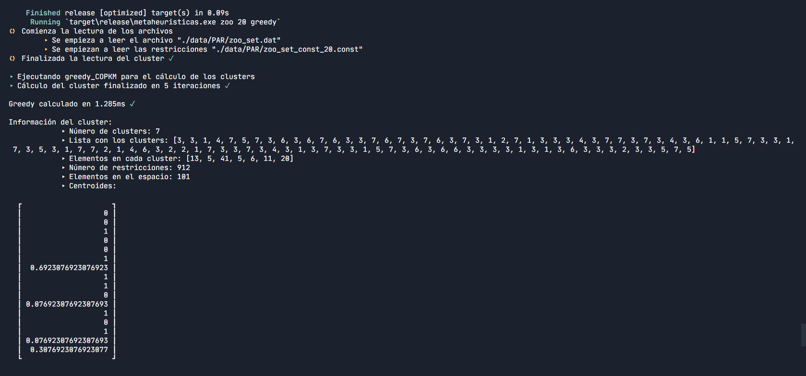
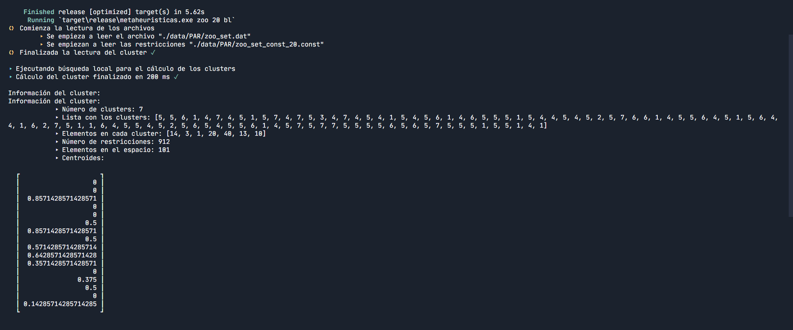

# Búsqueda local y greedy para el Problema de Agrupamiento con Restricciones


> **Autor**: Andrés Millán
> **DNI**:
> **Email**: amilmun@correo.ugr.es
> **Grupo de prácticas**: MH3

* * *

# Tabla de contenidos

- [Sobre esta memoria](#sobre-esta-memoria)
    - [Benchmark de uno o más algoritmos](#benchmark-de-uno-o-más-algoritmos)
    - [Ejecutar uno o varios algoritmos para un dataset en particular](#ejecutar-uno-o-varios-algoritmos-para-un-dataset-en-particular)
- [Descripción del problema](#descripción-del-problema)
- [Procedimiento seguido para resolver la práctica](#procedimiento-seguido-para-resolver-la-práctica)
  - [Crates usadas](#crates-usadas)
  - [Estructura del programa](#estructura-del-programa)
  - [La clase `Clusters`](#la-clase-clusters)
    - [Sobre las dimensiones](#sobre-las-dimensiones)
    - [Elementos del espacio](#elementos-del-espacio)
    - [Representación de las soluciones](#representación-de-las-soluciones)
    - [Restricciones](#restricciones)
    - [Estadísticos](#estadísticos)
- [Algoritmos considerados](#algoritmos-considerados)
  - [Greedy](#greedy)
    - [Descripción del algoritmo](#descripción-del-algoritmo)
  - [Búsqueda local](#búsqueda-local)
    - [Descripción del algoritmo](#descripción-del-algoritmo-1)
    - [Implementación](#implementación)
- [Análisis de resultados](#análisis-de-resultados)
  - [Descripción de los casos del problema empleados](#descripción-de-los-casos-del-problema-empleados)
  - [Benchmarking y resultados obtenidos](#benchmarking-y-resultados-obtenidos)
    - [Greedy](#greedy-1)
      - [Restricciones al 10%](#restricciones-al-10)
      - [Restricciones al 20%](#restricciones-al-20)
    - [Búsqueda local](#búsqueda-local-1)
      - [Restricciones al 10%](#restricciones-al-10-1)
      - [Restricciones al 20%](#restricciones-al-20-1)
  - [Síntesis](#síntesis)
- [Referencias](#referencias)

* * *

## Sobre esta memoria


En esta memoria se recoge toda la información necesaria para resolver el problema del **agrupamiento con restricciones**, así como la documentación y el desarrollo de las prácticas de la asignatura Metaheurísticas.

Todo el código está subido en el repositorio de Github https://github.com/Asmilex/Metaheuristicas. Para ejecutarlo, es necesario [tener instalado Rust](https://www.rust-lang.org/tools/install). El comprimido de la entrega contendrá los mismos archivos que se encuentran en el repositorio. El único cambio será la fecha de la versión y la localización del PDF generado a partir de este archivo.

Se puede compilar y correr el proyecto con `cargo run --release`. Sin embargo, es necesario especificar ciertos parámetros de entrada, que dependerán de lo que se quiera hacer. Estas son las posibilidades:

#### Benchmark de uno o más algoritmos

Escribir en la línea de comandos `cargo run --release benchmark [algoritmos]`. donde `[algoritmos]` son uno o más elementos de la siguiente lista:
- `greedy`.
- `bl`.

Si no se especifica ninguno, se usarán todos. Cada algoritmo se ejecuta 5 veces por dataset (por lo que cada uno se realiza 30 veces). La información resultante se exportará al archivo `./data/csv/[nombre del algoritmo]_[dataset]_[número de restricciones].csv`, el cual contendrá las medidas necesarias para el posterior análisis que realizaremos.

#### Ejecutar uno o varios algoritmos para un dataset en particular

Para ejecutar un único algoritmo para un cierto dataset, se debe introducir en la línea de comandos `cargo run --release [dataset] {10, 20} [algoritmos]`, donde `[dataset]` puede valer `bupa`, `glass` o `zoo`, eligiendo qué conjunto de restricciones usar (`10` o `20`). La lista de algoritmos funciona de la misma manera que en el apartado anterior.


* * *


## Descripción del problema

A lo largo de estas prácticas se resolverá el problema del **agrupamiento con restricciones**. Este es una modificación del clásico problema del *clustering*, el cual se describe de la siguiente forma:

Se nos presenta una lista de elementos con un cierto número de atributos. Los representaremos como vectores en $[0, 1]^d$. Debemos agruparlos en un cierto número de categorías, llamados **clústers**, de forma que se minimice la distancia entre estos vectores.

Nuestro matiz consiste en que les pondremos restricciones a los elementos a analizar. De esta forma, forzaremos a que dos vectores deban localizarse en en mismo clúster, o lo contrario; que deban estar en clusters distintos. Por tanto, no solo debemos conseguir una denominada *distancia intraclúster* baja, sino que se debe violar el mínimo número de restricciones posibles.

Durante estas prácticas propondremos diferentes algoritmos para resolver este problema. En la práctica 1, presentaremos soluciones sencillas basadas en algoritmos simples como **Greedy** o **Búsqueda Local**.


* * *


## Procedimiento seguido para resolver la práctica

Todo el código está escrito en **Rust**. Es un lenguaje moderno, eficiente y fiable en cuestiones relativas a accesos a memoria. Su elección ha sido puro interés personal.

### Crates usadas

Para facilitar la implementación, se han utilizado una serie de *crates* (nombre que reciben las librerías por parte de los *rustáceos*). Estas son:
- [Naglebra](https://www.nalgebra.org/): una librería de álgebra lineal. Utilizada para operaciones con matrices y vectores.
- [Rand](https://docs.rs/rand/0.8.3/rand/): para los generadores de números aleatorios.
- [Multimap](https://docs.rs/multimap/0.8.3/multimap/index.html): para el almacenamiento eficiente de las listas de restricciones.
- [Csv](https://docs.rs/csv/1.1.6/csv/): para exportar los resultados a `.csv`.
- [Colored](https://docs.rs/colored/2.0.0/colored/): para hacer más bonitas y legibles las salidas a consola.


### Estructura del programa

Se han dividido las funcionalidades clave del programa en distintos ficheros. Estos son:
- `main.rs`: contiene el código relacionado con la realización de una ejecución simple y de un benchmark, así como el *parseo* de argumentos.
- `file_io.rs`: aquí se ubican las funciones relacionadas con entrada/salida de archivos. En particular, la lectura de los ficheros de restricciones y la salida a los archivos csv.
- `utils.rs`: se definen las diferentes estructuras relacionadas con el problema. Por ejemplo, `ParametrosDataset` agrupa los datos necesarios para operar un cierto dataset.
- `algorithm.rs`: todos los algoritmos implementados se encuentran aquí. Ahora mismo, estos son Greedy y Búsqueda Local.
- `clúster.rs`: las principales estructuras necesarias para resolver el problema se localizan en este fichero. Específicamente, la clase `Clusters`. Estudiaremos a fondo sus elementos.


### La clase `Clusters`

Esta estructura supondrá el grueso de nuestro programa. *Agrupará* toda la información pertinente a la resolución del problema. En las siguientes secciones, describiremos sus elementos. No obstante, omitiremos las funciones de poco interés didáctico

#### Sobre las dimensiones

Necesitaremos tres medidas para generar una solución:

- `num_clusters` representa el número de clústers fijado por el problema.
- `dim_vectores` es el número de atributos del dataset.
- `num_elementos` es el número de vectores o muestras del dataset.


#### Elementos del espacio

La clase conoce en todo momento el conjunto de elementos del dataset que estamos tratando, así como sus distancias respectivas. Los miembros que se encargan de guardar esta información son `espacio` y `distancias` respectivamente. El cálculo de la variable $\lambda$, de la cual hablaremos más tarde, se guarda cuál es el máximo de las distancias al calcular la matriz `distancias`.

Para almacenar los vectores, hemos utilizado un vector de `Nalgebra::DVector`, un tipo de array dinámico con funciones de álgebra lineal. Esto nos será de gran ayuda, pues simplificará las operaciones del espacio vectorial con el que tratamos.


#### Representación de las soluciones

Las soluciones se representan con una lista de enteros, `lista_clusters`, de forma que, para una cierta entrada $i$ de dicha lista:
- Si su valor es $0$, entonces, ese elemento no tiene clúster asignado
- En otro caso, su valor está en el conjunto $\{1, ..., num\_clusters\}$.

Una solución solo se considerará válida si todo clúster tiene al menos un elemento asignado. Si algún elemento ha modificado su clúster, la clase automáticamente lo registra en la estructura `recuento_clusters`, por lo que nos resultará sencillo comprobar cuántos elementos hay en cada uno.


#### Restricciones

Representaremos las restricciones de dos formas distintas:
1. La primera de ellas es mediante una matriz dinámica de *Nalgebra* (`restricciones`) con entradas que toman valores en ${0, 1, -1}$. Para una cierta entrada $[(i, j)]$, si su valor es $0$, no hay ninguna restricción aplicada del vector con posición $i$ y el vector $j$. Si es $1$, entonces es una restricción del tipo `Must-Link`; esto es, deben ir agrupadas en el mismo clúster. Si su entrada es $-1$, ocurre lo contrario al caso anterior: estos dos vectores tienen una restricción del tipo `Cannot-Link`, y deben ir en clústers distintos. Esta estructura de datos nos resultará útil cuando queramos calcular el infeasibility de todo el sistema.
2. La segunda es un *hashmap* para cada tipo de restricción. Dado un cierto índice $i$, los hashmaps `restricciones_ML` y `restricciones_CL` devuelven todos los índices con los que tienen restricciones. Aceleran muchísimo el cálculo del infeasibility generado por la asignación de un clúster a un cierto elemento.

El número de restricciones se guarda al crear la matriz de restricciones.

#### Estadísticos

El interés de este problema reside en ser capaces de crear clústers lo más verosímiles posibles entre sí. Por tanto, para determinar cómo de buena es una solución, necesitamos algún tipo de estadístico que nos informe de ello. Debido a la naturaleza del problema, vamos a considerar dos: El **infeasibility** y el **fitness**.
- **Infeasiblity** es una medida de cuántas restricciones han sido violadas en conjunto; es decir, cuántos elementos con restricción *Cannot-Link* han caído en el mismo clúster, y cuántos vectores con restricción del tipo *Must-Link* se encuentran en clústers separados. La función `infeasibility()` nos permite conocer esto.
Sin embargo, no siempre nos interesa saber cuál es el estado de todo el sistema, sino cómo de malo sería meter un elemento en un cierto clúster. Para esto sirve la función `infeasibility_esperada(indice, clúster)`. Es una forma mucho más rápida de comprobar incrementos y decrementos en el sistema.
- En este problema, tanto las restricciones incumplidas como la distancia entre los elementos son importantes. Por ello, el **fitness** considera ambas. Éste se define de la siguiente manera:
$$
\text{fitness} = \text{desviación general de la partición} + \lambda \cdot \text{infeasiblity}
$$
donde la desviación general de la partición es la media de la suma de las distancias medias intraclúster, y $\lambda$ se define como el cociente entre el máximo de las distancias en el sistema y el número de restricciones totales del sistema. Se puede conocer gracias a la función `fitness()`.


* * *


## Algoritmos considerados

Los algoritmos implementados en la práctica 1 son capaces de generar una solución partiendo de un objeto de la clase `Clusters` sin asignaciones. Es el único punto en el que podrán encontrarse en este estado.

Dado que todos los métodos de resolución que programemos requieren aleatoriedad, fijaremos unas semillas para todos los generadores del programas. Se encuentran almacenadas en la clase `utils.rs/Semillas`. Estas son: `328471273`, `1821789317287`, `128931083781`, `1802783721873`, `9584985309`. El generador usado es el que recomienda la documentación del crate `rand`: `StdRng`. El algoritmo que utiliza es el Chacha block cipher de 12 rondas.


### Greedy

El algoritmo **Greedy K-medias aplicado a clustering con restricciones** es capaz de proporcionarnos una solución relativamente buena en muy pocos milisegundos. Su implementación es muy sencilla, así como la idea que hay tras éste.

#### Descripción del algoritmo

Partiendo de un clúster vacío, pero con todos los elementos cargados, consideramos una serie de centroides aleatorios, tantos como número de clústers debamos generar. Recorremos los elementos del espacio de forma aleatoria, de manera que asignamos cada uno al clúster en el que menor número de restricciones se viola (esto es, de menor infeasibility). En caso de empate, se asigna al clúster con cenroide más cercano a nuestro punto, entendiendo por cercano a aquel centroide que minimiza la distancia euclidiana. Se actualizan los centroides, y se repite todo hasta que la solución se estabilice.

El pseudocódigo, por tanto, quedaría así:

```
Greedy_COPKM

1. Generar centroides aleatorios con distribución uniforme en R^d.
2. Barajar los índices de forma aleatoria y sin repetición.
3. Mientras se produzcan cambios en el clúster:
  3.1. Para cada índice, mirar qué incremento supone en la infeasibility al asignarlo a un clúster. Tomar el menor de estos.
  3.2. Actualizar los centroides
```



En la sección [Análisis de resultados](#análisis-de-resultados) comprobaremos cómo de buena es la solución obtenida.


* * *


### Búsqueda local

**Búsqueda local** es la primera metaheurística que programaremos. Aunque es un algoritmo conceptualmente sencillo, supone una mejora en ciertos aspectos con respecto a Greedy. Se basa en la exploración de vecinos a la solución actual, tomando el mejor de entre los posibles. Por su naturaleza, suele generar óptimos locales.


#### Descripción del algoritmo

Como hemos citado, se exploran los vecinos de una cierta solución, mirando en cada iteración cuáles son las mejores soluciones. Se define un vecino como la asignación de clúster $c$ al $i-ésimo$ elemento del espacio partiendo de una solución actual. Debemos verificar que la posible solución generada con este operador es válida, pues en otro caso, no tiene sentido seguir.

El concepto de *mejor solución* es el que proporciona el fitness. Es decir, en cada iteración, se comprobará si el vecino tiene un fitness menor que el actual. Si es así, la siguiente solución a explorar será esta.

#### Implementación

El pseudocódigo del algoritmo es el siguiente:

```
Generar una solución válida inicial.

Hasta que no se haya alcanzado un óptimo local
├ Guardar la información de la solución actual relevante: fitness, infeasibility,
├ Barajar los índices {0, ..., num_elementos}
│
├ Para i en los índices barajados
│  ├ Barajar los clústers {1, ..., num_clusters}
│  │
│  ├ Para c en los clústers barajados
│  │  ├ Si el clúster del i-ésimo elemento no es c
│  │  │  ├ Comprobar si el vecino nuevo es válido
│  │  │  ├ En ese caso, comprobar si tiene un fitness menor.
│  │  │  └ Si es así, reexplorar todos los índices de nuevo y actualizar la información de la solución nueva.
│  │  │
└  └  └─ Si se ha encontrado una nueva solución, ignorar el resto de índices.
```

Las operaciones más relevantes de este algoritmo las realizamos en la función `bl_fitness_posible_sol(i, c, antiguo_infeasibility)`. Por cómo está gestionado internamente el clúster, es mucho más rápido verificar que la solución es válida dentro del propio clúster, y no fuera. Esta función se encarga de asignar temporalmente el vecino, comprobar si es válido, y en caso de serlo, devolver qué fitness produciría. El motivo de que necesite el antiguo infeasibility es por eficiencia. En vez de calcular todo el sistema para cada vecino nuevo, se calcula de la siguiente manera:
$$
\text{Infeasibility nuevo} = (\text{infeasibility antiguo})  - (\text{infeasilibity producido por el cluster antiguo para el vector i}) + (\text{infeasibility producido por el nuevo cluster c para el vector i})
$$

Como mencionamos en uno de los apartados anteriores, el cálculo de esta delta es muchísimo más rápido que el de todo el sistema. En la siguiente sección comprobaremos cuánto tarda en total un bechmark.




## Análisis de resultados

En esta sección discutiremos los resultados obtenidos por ambos algoritmos. Presentaremos los parámetros de los datasets utilizados, las distancias óptimas conocidas de estas, y cuánto se acercan Greedy y Búsqueda Local a esta.

### Descripción de los casos del problema empleados

Los datasets usados reciben el nombre de `Zoo`, `Glass`, y `Bupa`. Los dos primeros presentan una dificultad similar, mientras que el último requiere de un mayor tiempo de cómputo.

|                      | **Zoo** | **Glass** |  **Bupa** |
|----------------------|--------:|----------:|----------:|
| **Atributos**        | `16`    | `9`       | `5`       |
| **Clusters**         | `7`     | `7`       | `16`      |
| **Instancias**       | `101`   | `214`     | `345`     |
| **Distancia óptima** | `0.9048`| `0.36429` | `0.229248`|

Sobre estos conjuntos se ha impuesto un número de restricciones: al 10% y al 20%. Naturalmente, cuantas más restricciones, más costoso resulta computar una solución aceptable, pues el sistema contempla una mayor cantidad de enlaces entre sus elementos.
Los ficheros ubicados en `./data/PAR` guardan la información sobre los datasets.

### Benchmarking y resultados obtenidos

Cada algoritmo se ha ejecutado 5 veces por dataset. Como tenemos 3 datasets y 2 restricciones para cada uno, nos encontramos un total de 30 ejecuciones por algoritmo. Estudiaremos las siguientes medidas:
- **Tasa de infeasibility**: número de restricciones que se incumplen en la solución.
- **Error de la distancia**: Es el valor absoluto de la diferencia de la desviación intracluster media y la distancia óptima conocida hasta ahora.
- **Agregado**: el fitness de la solución.
- **Tiempo de ejecución** (ms).

* * *

#### Greedy
##### Restricciones al 10%
<table class="tg">
<thead">
  <tr>
    <th style="text-align:right"></th>
    <th style="text-align:center" colspan="4"><span style="font-weight:bold">Zoo</span></th>
    <th style="text-align:center" colspan="4"><span style="font-weight:bold">Glass</span></th>
    <th style="text-align:center" colspan="4"><span style="font-weight:bold">Bupa</span></th>
  </tr>
</thead>
<tbody>
  <tr>
    <td style="text-align:right"></td>
    <td style="text-align:center"><span style="font-weight:bold">Tasa_inf</span></td>
    <td style="text-align:center"><span style="font-weight:bold">Error_dist</span></td>
    <td style="text-align:center"><span style="font-weight:bold">Agr</span></td>
    <td style="text-align:center"><span style="font-weight:bold">T </span>(ms)</td>
    <td style="text-align:center"><span style="font-weight:bold">Tasa_inf</span></td>
    <td style="text-align:center"><span style="font-weight:bold">Error_dist</span></td>
    <td style="text-align:center"><span style="font-weight:bold">Agr</span></td>
    <td style="text-align:center"><span style="font-weight:bold">T </span>(ms)</td>
    <td style="text-align:center"><span style="font-weight:bold">Tasa_inf</span></td>
    <td style="text-align:center"><span style="font-weight:bold">Error_dist</span></td>
    <td style="text-align:center"><span style="font-weight:bold">Agr</span></td>
    <td style="text-align:center"><span style="font-weight:bold">T </span>(ms)</td>
  </tr>
  <tr>
    <td style="text-align:left"><span style="font-weight:bold">Ejecución 1</span></td>
    <td style="text-align:right;font-family: Cousine;font-size: 13px">5</td>
    <td style="text-align:right;font-family: Cousine;font-size: 13px">0,0799</td>
    <td style="text-align:right;font-family: Cousine;font-size: 13px">1,0226</td>
    <td style="text-align:right;font-family: Cousine;font-size: 13px">0</td>
    <td style="text-align:right;font-family: Cousine;font-size: 13px">6</td>
    <td style="text-align:right;font-family: Cousine;font-size: 13px">0,0012</td>
    <td style="text-align:right;font-family: Cousine;font-size: 13px">0,3689</td>
    <td style="text-align:right;font-family: Cousine;font-size: 13px">2</td>
    <td style="text-align:right;font-family: Cousine;font-size: 13px">28</td>
    <td style="text-align:right;font-family: Cousine;font-size: 13px">0,0072</td>
    <td style="text-align:right;font-family: Cousine;font-size: 13px">0,2294</td>
    <td style="text-align:right;font-family: Cousine;font-size: 13px">12</td>
  </tr>
  <tr>
    <td style="text-align:left"><span style="font-weight:bold">Ejecución 2</span></td>
    <td style="text-align:right;font-family: Cousine;font-size: 13px">0</td>
    <td style="text-align:right;font-family: Cousine;font-size: 13px">0,0236</td>
    <td style="text-align:right;font-family: Cousine;font-size: 13px">0,9284</td>
    <td style="text-align:right;font-family: Cousine;font-size: 13px">2</td>
    <td style="text-align:right;font-family: Cousine;font-size: 13px">3</td>
    <td style="text-align:right;font-family: Cousine;font-size: 13px">0,0111</td>
    <td style="text-align:right;font-family: Cousine;font-size: 13px">0,3784</td>
    <td style="text-align:right;font-family: Cousine;font-size: 13px">2</td>
    <td style="text-align:right;font-family: Cousine;font-size: 13px">33</td>
    <td style="text-align:right;font-family: Cousine;font-size: 13px">0,0076</td>
    <td style="text-align:right;font-family: Cousine;font-size: 13px">0,2457</td>
    <td style="text-align:right;font-family: Cousine;font-size: 13px">15</td>
  </tr>
  <tr>
    <td style="text-align:left"><span style="font-weight:bold">Ejecución 3</span></td>
    <td style="text-align:right;font-family: Cousine;font-size: 13px">1</td>
    <td style="text-align:right;font-family: Cousine;font-size: 13px">0,0446</td>
    <td style="text-align:right;font-family: Cousine;font-size: 13px">0,9570</td>
    <td style="text-align:right;font-family: Cousine;font-size: 13px">1</td>
    <td style="text-align:right;font-family: Cousine;font-size: 13px">1</td>
    <td style="text-align:right;font-family: Cousine;font-size: 13px">0,0163</td>
    <td style="text-align:right;font-family: Cousine;font-size: 13px">0,3816</td>
    <td style="text-align:right;font-family: Cousine;font-size: 13px">2</td>
    <td style="text-align:right;font-family: Cousine;font-size: 13px">33</td>
    <td style="text-align:right;font-family: Cousine;font-size: 13px">0,0042</td>
    <td style="text-align:right;font-family: Cousine;font-size: 13px">0,2422</td>
    <td style="text-align:right;font-family: Cousine;font-size: 13px">14</td>
  </tr>
  <tr>
    <td style="text-align:left"><span style="font-weight:bold">Ejecución 4</span></td>
    <td style="text-align:right;font-family: Cousine;font-size: 13px">0</td>
    <td style="text-align:right;font-family: Cousine;font-size: 13px">0,0081</td>
    <td style="text-align:right;font-family: Cousine;font-size: 13px">0,8966</td>
    <td style="text-align:right;font-family: Cousine;font-size: 13px">1</td>
    <td style="text-align:right;font-family: Cousine;font-size: 13px">3</td>
    <td style="text-align:right;font-family: Cousine;font-size: 13px">0,0125</td>
    <td style="text-align:right;font-family: Cousine;font-size: 13px">0,3798</td>
    <td style="text-align:right;font-family: Cousine;font-size: 13px">3</td>
    <td style="text-align:right;font-family: Cousine;font-size: 13px">12</td>
    <td style="text-align:right;font-family: Cousine;font-size: 13px">0,0092</td>
    <td style="text-align:right;font-family: Cousine;font-size: 13px">0,2231</td>
    <td style="text-align:right;font-family: Cousine;font-size: 13px">10</td>
  </tr>
  <tr>
    <td style="text-align:left"><span style="font-weight:bold">Ejecución 5</span></td>
    <td style="text-align:right;font-family: Cousine;font-size: 13px">0</td>
    <td style="text-align:right;font-family: Cousine;font-size: 13px">0,0570</td>
    <td style="text-align:right;font-family: Cousine;font-size: 13px">0,9618</td>
    <td style="text-align:right;font-family: Cousine;font-size: 13px">1</td>
    <td style="text-align:right;font-family: Cousine;font-size: 13px">7</td>
    <td style="text-align:right;font-family: Cousine;font-size: 13px">0,0331</td>
    <td style="text-align:right;font-family: Cousine;font-size: 13px">0,4043</td>
    <td style="text-align:right;font-family: Cousine;font-size: 13px">2</td>
    <td style="text-align:right;font-family: Cousine;font-size: 13px">37</td>
    <td style="text-align:right;font-family: Cousine;font-size: 13px">0,0025</td>
    <td style="text-align:right;font-family: Cousine;font-size: 13px">0,2366</td>
    <td style="text-align:right;font-family: Cousine;font-size: 13px">14</td>
  </tr>
  <tr>
    <td style="text-align:left"><span style="font-weight:bold">Media</span></td>
    <td style="text-align:right;font-family: Cousine;font-size: 13px">1,2</td>
    <td style="text-align:right;font-family: Cousine;font-size: 13px">0,0426</td>
    <td style="text-align:right;font-family: Cousine;font-size: 13px">0,9533</td>
    <td style="text-align:right;font-family: Cousine;font-size: 13px">1</td>
    <td style="text-align:right;font-family: Cousine;font-size: 13px">4</td>
    <td style="text-align:right;font-family: Cousine;font-size: 13px">0,0171</td>
    <td style="text-align:right;font-family: Cousine;font-size: 13px">0,3866</td>
    <td style="text-align:right;font-family: Cousine;font-size: 13px">2</td>
    <td style="text-align:right;font-family: Cousine;font-size: 13px">28,6</td>
    <td style="text-align:right;font-family: Cousine;font-size: 13px">0,0062</td>
    <td style="text-align:right;font-family: Cousine;font-size: 13px">0,2354</td>
    <td style="text-align:right;font-family: Cousine;font-size: 13px">13</td>
  </tr>
</tbody>
</table>

##### Restricciones al 20%

<table class="tg">
<thead">
  <tr>
    <th style="text-align:right"></th>
    <th style="text-align:center" colspan="4"><span style="font-weight:bold">Zoo</span></th>
    <th style="text-align:center" colspan="4"><span style="font-weight:bold">Glass</span></th>
    <th style="text-align:center" colspan="4"><span style="font-weight:bold">Bupa</span></th>
  </tr>
</thead>
<tbody>
  <tr>
    <td style="text-align:right"></td>
    <td style="text-align:right"><span style="font-weight:bold">Tasa_inf</span></td>
    <td style="text-align:right"><span style="font-weight:bold">Error_dist</span></td>
    <td style="text-align:right"><span style="font-weight:bold">Agr</span></td>
    <td style="text-align:right"><span style="font-weight:bold">T </span>(ms)</td>
    <td style="text-align:right"><span style="font-weight:bold">Tasa_inf</span></td>
    <td style="text-align:right"><span style="font-weight:bold">Error_dist</span></td>
    <td style="text-align:right"><span style="font-weight:bold">Agr</span></td>
    <td style="text-align:right"><span style="font-weight:bold">T </span>(ms)</td>
    <td style="text-align:right"><span style="font-weight:bold">Tasa_inf</span></td>
    <td style="text-align:right"><span style="font-weight:bold">Error_dist</span></td>
    <td style="text-align:right"><span style="font-weight:bold">Agr</span></td>
    <td style="text-align:right"><span style="font-weight:bold">T </span>(ms)</td>
  </tr>
  <tr>
    <td style="text-align:left"><span style="font-weight:bold">Ejecución 1</span></td>
    <td style="text-align:right;font-family: Cousine;font-size: 13px">2</td>
    <td style="text-align:right;font-family: Cousine;font-size: 13px">0,0516</td>
    <td style="text-align:right;font-family: Cousine;font-size: 13px">0,9645</td>
    <td style="text-align:right;font-family: Cousine;font-size: 13px">1</td>
    <td style="text-align:right;font-family: Cousine;font-size: 13px">0</td>
    <td style="text-align:right;font-family: Cousine;font-size: 13px">0,0086</td>
    <td style="text-align:right;font-family: Cousine;font-size: 13px">0,3556</td>
    <td style="text-align:right;font-family: Cousine;font-size: 13px">1</td>
    <td style="text-align:right;font-family: Cousine;font-size: 13px">12</td>
    <td style="text-align:right;font-family: Cousine;font-size: 13px">0,0129</td>
    <td style="text-align:right;font-family: Cousine;font-size: 13px">0,2439</td>
    <td style="text-align:right;font-family: Cousine;font-size: 13px">5</td>
  </tr>
  <tr>
    <td style="text-align:left"><span style="font-weight:bold">Ejecución 2</span></td>
    <td style="text-align:right;font-family: Cousine;font-size: 13px">1</td>
    <td style="text-align:right;font-family: Cousine;font-size: 13px">0,0738</td>
    <td style="text-align:right;font-family: Cousine;font-size: 13px">0,9827</td>
    <td style="text-align:right;font-family: Cousine;font-size: 13px">0</td>
    <td style="text-align:right;font-family: Cousine;font-size: 13px">1</td>
    <td style="text-align:right;font-family: Cousine;font-size: 13px">0,0103</td>
    <td style="text-align:right;font-family: Cousine;font-size: 13px">0,3544</td>
    <td style="text-align:right;font-family: Cousine;font-size: 13px">1</td>
    <td style="text-align:right;font-family: Cousine;font-size: 13px">7</td>
    <td style="text-align:right;font-family: Cousine;font-size: 13px">0,0170</td>
    <td style="text-align:right;font-family: Cousine;font-size: 13px">0,2131</td>
    <td style="text-align:right;font-family: Cousine;font-size: 13px">5</td>
  </tr>
  <tr>
    <td style="text-align:left"><span style="font-weight:bold">Ejecución 3</span></td>
    <td style="text-align:right;font-family: Cousine;font-size: 13px">3</td>
    <td style="text-align:right;font-family: Cousine;font-size: 13px">0,0813</td>
    <td style="text-align:right;font-family: Cousine;font-size: 13px">0,9982</td>
    <td style="text-align:right;font-family: Cousine;font-size: 13px">1</td>
    <td style="text-align:right;font-family: Cousine;font-size: 13px">0</td>
    <td style="text-align:right;font-family: Cousine;font-size: 13px">0,0517</td>
    <td style="text-align:right;font-family: Cousine;font-size: 13px">0,3125</td>
    <td style="text-align:right;font-family: Cousine;font-size: 13px">1</td>
    <td style="text-align:right;font-family: Cousine;font-size: 13px">8</td>
    <td style="text-align:right;font-family: Cousine;font-size: 13px">0,0111</td>
    <td style="text-align:right;font-family: Cousine;font-size: 13px">0,2415</td>
    <td style="text-align:right;font-family: Cousine;font-size: 13px">6</td>
  </tr>
  <tr>
    <td style="text-align:left"><span style="font-weight:bold">Ejecución 4</span></td>
    <td style="text-align:right;font-family: Cousine;font-size: 13px">3</td>
    <td style="text-align:right;font-family: Cousine;font-size: 13px">0,0927</td>
    <td style="text-align:right;font-family: Cousine;font-size: 13px">1,0096</td>
    <td style="text-align:right;font-family: Cousine;font-size: 13px">1</td>
    <td style="text-align:right;font-family: Cousine;font-size: 13px">0</td>
    <td style="text-align:right;font-family: Cousine;font-size: 13px">0,0086</td>
    <td style="text-align:right;font-family: Cousine;font-size: 13px">0,3556</td>
    <td style="text-align:right;font-family: Cousine;font-size: 13px">1</td>
    <td style="text-align:right;font-family: Cousine;font-size: 13px">19</td>
    <td style="text-align:right;font-family: Cousine;font-size: 13px">0,0091</td>
    <td style="text-align:right;font-family: Cousine;font-size: 13px">0,2410</td>
    <td style="text-align:right;font-family: Cousine;font-size: 13px">5</td>
  </tr>
  <tr>
    <td style="text-align:left"><span style="font-weight:bold">Ejecución 5</span></td>
    <td style="text-align:right;font-family: Cousine;font-size: 13px">1</td>
    <td style="text-align:right;font-family: Cousine;font-size: 13px">0,1119</td>
    <td style="text-align:right;font-family: Cousine;font-size: 13px">1,0208</td>
    <td style="text-align:right;font-family: Cousine;font-size: 13px">0</td>
    <td style="text-align:right;font-family: Cousine;font-size: 13px">0</td>
    <td style="text-align:right;font-family: Cousine;font-size: 13px">0,0086</td>
    <td style="text-align:right;font-family: Cousine;font-size: 13px">0,3556</td>
    <td style="text-align:right;font-family: Cousine;font-size: 13px">4</td>
    <td style="text-align:right;font-family: Cousine;font-size: 13px">0</td>
    <td style="text-align:right;font-family: Cousine;font-size: 13px">0,0024</td>
    <td style="text-align:right;font-family: Cousine;font-size: 13px">0,2317</td>
    <td style="text-align:right;font-family: Cousine;font-size: 13px">7</td>
  </tr>
  <tr>
    <td style="text-align:left"><span style="font-weight:bold">Media</span></td>
    <td style="text-align:right;font-family: Cousine;font-size: 13px">2</td>
    <td style="text-align:right;font-family: Cousine;font-size: 13px">0,0823</td>
    <td style="text-align:right;font-family: Cousine;font-size: 13px">0,9951</td>
    <td style="text-align:right;font-family: Cousine;font-size: 13px">0,6</td>
    <td style="text-align:right;font-family: Cousine;font-size: 13px">0,2</td>
    <td style="text-align:right;font-family: Cousine;font-size: 13px">0,0176</td>
    <td style="text-align:right;font-family: Cousine;font-size: 13px">0,3467</td>
    <td style="text-align:right;font-family: Cousine;font-size: 13px">1,6</td>
    <td style="text-align:right;font-family: Cousine;font-size: 13px">9,2</td>
    <td style="text-align:right;font-family: Cousine;font-size: 13px">0,0105</td>
    <td style="text-align:right;font-family: Cousine;font-size: 13px">0,2342</td>
    <td style="text-align:right;font-family: Cousine;font-size: 13px">5,6</td>
  </tr>
</tbody>
</table>

* * *

#### Búsqueda local
##### Restricciones al 10%
<table class="tg">
<thead>
  <tr>
    <th></th>
    <th style="text-align:center" colspan="4"><span style="font-weight:bold">Zoo</span></th>
    <th style="text-align:center" colspan="4"><span style="font-weight:bold">Glass</span></th>
    <th style="text-align:center" colspan="4"><span style="font-weight:bold">Bupa</span></th>
  </tr>
</thead>
<tbody>
  <tr>
    <td class="tg-0pky"></td>
    <td style="text-align:right"><span style="font-weight:bold">Tasa_inf</span></td>
    <td style="text-align:right"><span style="font-weight:bold">Error_dist</span></td>
    <td style="text-align:right"><span style="font-weight:bold">Agr</span></td>
    <td style="text-align:right"><span style="font-weight:bold">T </span>(ms)</td>
    <td style="text-align:right"><span style="font-weight:bold">Tasa_inf</span></td>
    <td style="text-align:right"><span style="font-weight:bold">Error_dist</span></td>
    <td style="text-align:right"><span style="font-weight:bold">Agr</span></td>
    <td style="text-align:right"><span style="font-weight:bold">T </span>(ms)</td>
    <td style="text-align:right"><span style="font-weight:bold">Tasa_inf</span></td>
    <td style="text-align:right"><span style="font-weight:bold">Error_dist</span></td>
    <td style="text-align:right"><span style="font-weight:bold">Agr</span></td>
    <td style="text-align:right"><span style="font-weight:bold">T </span>(ms)</td>
  </tr>
  <tr>
    <td class="tg-0pky"><span style="font-weight:bold">Ejecución 1</span></td>
    <td style="text-align:right;font-family: Cousine;font-size: 13px">11</td>
    <td style="text-align:right;font-family: Cousine;font-size: 13px">0,2940</td>
    <td style="text-align:right;font-family: Cousine;font-size: 13px">0,6940</td>
    <td style="text-align:right;font-family: Cousine;font-size: 13px">126</td>
    <td style="text-align:right;font-family: Cousine;font-size: 13px">51</td>
    <td style="text-align:right;font-family: Cousine;font-size: 13px">0,1760</td>
    <td style="text-align:right;font-family: Cousine;font-size: 13px">0,2384</td>
    <td style="text-align:right;font-family: Cousine;font-size: 13px">618</td>
    <td style="text-align:right;font-family: Cousine;font-size: 13px">116</td>
    <td style="text-align:right;font-family: Cousine;font-size: 13px">0,1196</td>
    <td style="text-align:right;font-family: Cousine;font-size: 13px">0,1407</td>
    <td style="text-align:right;font-family: Cousine;font-size: 13px">10738</td>
  </tr>
  <tr>
    <td class="tg-0pky"><span style="font-weight:bold">Ejecución 2</span></td>
    <td style="text-align:right;font-family: Cousine;font-size: 13px">11</td>
    <td style="text-align:right;font-family: Cousine;font-size: 13px">0,2918</td>
    <td style="text-align:right;font-family: Cousine;font-size: 13px">0,6963</td>
    <td style="text-align:right;font-family: Cousine;font-size: 13px">161</td>
    <td style="text-align:right;font-family: Cousine;font-size: 13px">50</td>
    <td style="text-align:right;font-family: Cousine;font-size: 13px">0,1696</td>
    <td style="text-align:right;font-family: Cousine;font-size: 13px">0,2438</td>
    <td style="text-align:right;font-family: Cousine;font-size: 13px">460</td>
    <td style="text-align:right;font-family: Cousine;font-size: 13px">118</td>
    <td style="text-align:right;font-family: Cousine;font-size: 13px">0,1217</td>
    <td style="text-align:right;font-family: Cousine;font-size: 13px">0,1391</td>
    <td style="text-align:right;font-family: Cousine;font-size: 13px">5789</td>
  </tr>
  <tr>
    <td class="tg-0pky"><span style="font-weight:bold">Ejecución 3</span></td>
    <td style="text-align:right;font-family: Cousine;font-size: 13px">12</td>
    <td style="text-align:right;font-family: Cousine;font-size: 13px">0,2385</td>
    <td style="text-align:right;font-family: Cousine;font-size: 13px">0,7571</td>
    <td style="text-align:right;font-family: Cousine;font-size: 13px">120</td>
    <td style="text-align:right;font-family: Cousine;font-size: 13px">60</td>
    <td style="text-align:right;font-family: Cousine;font-size: 13px">0,1791</td>
    <td style="text-align:right;font-family: Cousine;font-size: 13px">0,2442</td>
    <td style="text-align:right;font-family: Cousine;font-size: 13px">641</td>
    <td style="text-align:right;font-family: Cousine;font-size: 13px">142</td>
    <td style="text-align:right;font-family: Cousine;font-size: 13px">0,1057</td>
    <td style="text-align:right;font-family: Cousine;font-size: 13px">0,1615</td>
    <td style="text-align:right;font-family: Cousine;font-size: 13px">4228</td>
  </tr>
  <tr>
    <td class="tg-0pky"><span style="font-weight:bold">Ejecución 4</span></td>
    <td style="text-align:right;font-family: Cousine;font-size: 13px">27</td>
    <td style="text-align:right;font-family: Cousine;font-size: 13px">0,1631</td>
    <td style="text-align:right;font-family: Cousine;font-size: 13px">0,9462</td>
    <td style="text-align:right;font-family: Cousine;font-size: 13px">186</td>
    <td style="text-align:right;font-family: Cousine;font-size: 13px">50</td>
    <td style="text-align:right;font-family: Cousine;font-size: 13px">0,1738</td>
    <td style="text-align:right;font-family: Cousine;font-size: 13px">0,2396</td>
    <td style="text-align:right;font-family: Cousine;font-size: 13px">453</td>
    <td style="text-align:right;font-family: Cousine;font-size: 13px">115</td>
    <td style="text-align:right;font-family: Cousine;font-size: 13px">0,1202</td>
    <td style="text-align:right;font-family: Cousine;font-size: 13px">0,1398</td>
    <td style="text-align:right;font-family: Cousine;font-size: 13px">6993</td>
  </tr>
  <tr>
    <td class="tg-0lax"><span style="font-weight:bold">Ejecución 5</span></td>
    <td style="text-align:right;font-family: Cousine;font-size: 13px">11</td>
    <td style="text-align:right;font-family: Cousine;font-size: 13px">0,2992</td>
    <td style="text-align:right;font-family: Cousine;font-size: 13px">0,6888</td>
    <td style="text-align:right;font-family: Cousine;font-size: 13px">112</td>
    <td style="text-align:right;font-family: Cousine;font-size: 13px">54</td>
    <td style="text-align:right;font-family: Cousine;font-size: 13px">0,1694</td>
    <td style="text-align:right;font-family: Cousine;font-size: 13px">0,2479</td>
    <td style="text-align:right;font-family: Cousine;font-size: 13px">545</td>
    <td style="text-align:right;font-family: Cousine;font-size: 13px">95</td>
    <td style="text-align:right;font-family: Cousine;font-size: 13px">0,1183</td>
    <td style="text-align:right;font-family: Cousine;font-size: 13px">0,1363</td>
    <td style="text-align:right;font-family: Cousine;font-size: 13px">6717</td>
  </tr>
  <tr>
    <td class="tg-0lax"><span style="font-weight:bold">Media</span></td>
    <td style="text-align:right;font-family: Cousine;font-size: 13px">14,4</td>
    <td style="text-align:right;font-family: Cousine;font-size: 13px">0,2573</td>
    <td style="text-align:right;font-family: Cousine;font-size: 13px">0,7565</td>
    <td style="text-align:right;font-family: Cousine;font-size: 13px">141</td>
    <td style="text-align:right;font-family: Cousine;font-size: 13px">53</td>
    <td style="text-align:right;font-family: Cousine;font-size: 13px">0,1736</td>
    <td style="text-align:right;font-family: Cousine;font-size: 13px">0,2428</td>
    <td style="text-align:right;font-family: Cousine;font-size: 13px">543,4</td>
    <td style="text-align:right;font-family: Cousine;font-size: 13px">117,2</td>
    <td style="text-align:right;font-family: Cousine;font-size: 13px">0,1171</td>
    <td style="text-align:right;font-family: Cousine;font-size: 13px">0,1435</td>
    <td style="text-align:right;font-family: Cousine;font-size: 13px">6893</td>
  </tr>
</tbody>
</table>

##### Restricciones al 20%

<table class="tg">
<thead>
  <tr>
    <th class="tg-0pky"></th>
    <th style="text-align:center" colspan="4"><span style="font-weight:bold">Zoo</span></th>
    <th style="text-align:center" colspan="4"><span style="font-weight:bold">Glass</span></th>
    <th style="text-align:center" colspan="4"><span style="font-weight:bold">Bupa</span></th>
  </tr>
</thead>
<tbody>
  <tr>
    <td class="tg-0pky"></td>
    <td style="text-align:right"><span style="font-weight:bold">Tasa_inf</span></td>
    <td style="text-align:right"><span style="font-weight:bold">Error_dist</span></td>
    <td style="text-align:right"><span style="font-weight:bold">Agr</span></td>
    <td style="text-align:right"><span style="font-weight:bold">T </span>(ms)</td>
    <td style="text-align:right"><span style="font-weight:bold">Tasa_inf</span></td>
    <td style="text-align:right"><span style="font-weight:bold">Error_dist</span></td>
    <td style="text-align:right"><span style="font-weight:bold">Agr</span></td>
    <td style="text-align:right"><span style="font-weight:bold">T </span>(ms)</td>
    <td style="text-align:right"><span style="font-weight:bold">Tasa_inf</span></td>
    <td style="text-align:right"><span style="font-weight:bold">Error_dist</span></td>
    <td style="text-align:right"><span style="font-weight:bold">Agr</span></td>
    <td style="text-align:right"><span style="font-weight:bold">T </span>(ms)</td>
  </tr>
  <tr>
    <td style="text-align:left"><span style="font-weight:bold">Ejecución 1</span></td>
    <td style="text-align:right;font-family: Cousine;font-size: 13px">18</td>
    <td style="text-align:right;font-family: Cousine;font-size: 13px">0,1728</td>
    <td style="text-align:right;font-family: Cousine;font-size: 13px">0,8045</td>
    <td style="text-align:right;font-family: Cousine;font-size: 13px">117</td>
    <td style="text-align:right;font-family: Cousine;font-size: 13px">37</td>
    <td style="text-align:right;font-family: Cousine;font-size: 13px">0,1141</td>
    <td style="text-align:right;font-family: Cousine;font-size: 13px">0,2694</td>
    <td style="text-align:right;font-family: Cousine;font-size: 13px">486</td>
    <td style="text-align:right;font-family: Cousine;font-size: 13px">264</td>
    <td style="text-align:right;font-family: Cousine;font-size: 13px">0,1199</td>
    <td style="text-align:right;font-family: Cousine;font-size: 13px">0,1461</td>
    <td style="text-align:right;font-family: Cousine;font-size: 13px">8105</td>
  </tr>
  <tr>
    <td class="tg-0pky"><span style="font-weight:bold">Ejecución 2</span></td>
    <td style="text-align:right;font-family: Cousine;font-size: 13px">18</td>
    <td style="text-align:right;font-family: Cousine;font-size: 13px">0,2193</td>
    <td style="text-align:right;font-family: Cousine;font-size: 13px">0,7581</td>
    <td style="text-align:right;font-family: Cousine;font-size: 13px">160</td>
    <td style="text-align:right;font-family: Cousine;font-size: 13px">30</td>
    <td style="text-align:right;font-family: Cousine;font-size: 13px">0,1134</td>
    <td style="text-align:right;font-family: Cousine;font-size: 13px">0,2664</td>
    <td style="text-align:right;font-family: Cousine;font-size: 13px">468</td>
    <td style="text-align:right;font-family: Cousine;font-size: 13px">209</td>
    <td style="text-align:right;font-family: Cousine;font-size: 13px">0,1175</td>
    <td style="text-align:right;font-family: Cousine;font-size: 13px">0,1408</td>
    <td style="text-align:right;font-family: Cousine;font-size: 13px">7039</td>
  </tr>
  <tr>
    <td class="tg-0pky"><span style="font-weight:bold">Ejecución 3</span></td>
    <td style="text-align:right;font-family: Cousine;font-size: 13px">18</td>
    <td style="text-align:right;font-family: Cousine;font-size: 13px">0,1532</td>
    <td style="text-align:right;font-family: Cousine;font-size: 13px">0,8242</td>
    <td style="text-align:right;font-family: Cousine;font-size: 13px">71</td>
    <td style="text-align:right;font-family: Cousine;font-size: 13px">38</td>
    <td style="text-align:right;font-family: Cousine;font-size: 13px">0,1185</td>
    <td style="text-align:right;font-family: Cousine;font-size: 13px">0,2655</td>
    <td style="text-align:right;font-family: Cousine;font-size: 13px">628</td>
    <td style="text-align:right;font-family: Cousine;font-size: 13px">224</td>
    <td style="text-align:right;font-family: Cousine;font-size: 13px">0,1151</td>
    <td style="text-align:right;font-family: Cousine;font-size: 13px">0,1453</td>
    <td style="text-align:right;font-family: Cousine;font-size: 13px">4555</td>
  </tr>
  <tr>
    <td class="tg-0pky"><span style="font-weight:bold">Ejecución 4</span></td>
    <td style="text-align:right;font-family: Cousine;font-size: 13px">10</td>
    <td style="text-align:right;font-family: Cousine;font-size: 13px">0,1711</td>
    <td style="text-align:right;font-family: Cousine;font-size: 13px">0,7740</td>
    <td style="text-align:right;font-family: Cousine;font-size: 13px">105</td>
    <td style="text-align:right;font-family: Cousine;font-size: 13px">36</td>
    <td style="text-align:right;font-family: Cousine;font-size: 13px">0,1142</td>
    <td style="text-align:right;font-family: Cousine;font-size: 13px">0,2687</td>
    <td style="text-align:right;font-family: Cousine;font-size: 13px">575</td>
    <td style="text-align:right;font-family: Cousine;font-size: 13px">162</td>
    <td style="text-align:right;font-family: Cousine;font-size: 13px">0,1088</td>
    <td style="text-align:right;font-family: Cousine;font-size: 13px">0,1429</td>
    <td style="text-align:right;font-family: Cousine;font-size: 13px">5845</td>
  </tr>
  <tr>
    <td style="text-align:left"><span style="font-weight:bold">Ejecución 5</span></td>
    <td style="text-align:right;font-family: Cousine;font-size: 13px">15</td>
    <td style="text-align:right;font-family: Cousine;font-size: 13px">0,1743</td>
    <td style="text-align:right;font-family: Cousine;font-size: 13px">0,7909</td>
    <td style="text-align:right;font-family: Cousine;font-size: 13px">161</td>
    <td style="text-align:right;font-family: Cousine;font-size: 13px">49</td>
    <td style="text-align:right;font-family: Cousine;font-size: 13px">0,1145</td>
    <td style="text-align:right;font-family: Cousine;font-size: 13px">0,2752</td>
    <td style="text-align:right;font-family: Cousine;font-size: 13px">486</td>
    <td style="text-align:right;font-family: Cousine;font-size: 13px">256</td>
    <td style="text-align:right;font-family: Cousine;font-size: 13px">0,1210</td>
    <td style="text-align:right;font-family: Cousine;font-size: 13px">0,1439</td>
    <td style="text-align:right;font-family: Cousine;font-size: 13px">6457</td>
  </tr>
  <tr>
    <td style="text-align:lef"><span style="font-weight:bold">Media</span></td>
    <td style="text-align:right;font-family: Cousine;font-size: 13px">15,8</td>
    <td style="text-align:right;font-family: Cousine;font-size: 13px">0,1782</td>
    <td style="text-align:right;font-family: Cousine;font-size: 13px">0,7904</td>
    <td style="text-align:right;font-family: Cousine;font-size: 13px">122,8</td>
    <td style="text-align:right;font-family: Cousine;font-size: 13px">38</td>
    <td style="text-align:right;font-family: Cousine;font-size: 13px">0,1149</td>
    <td style="text-align:right;font-family: Cousine;font-size: 13px">0,2691</td>
    <td style="text-align:right;font-family: Cousine;font-size: 13px">528,6</td>
    <td style="text-align:right;font-family: Cousine;font-size: 13px">223</td>
    <td style="text-align:right;font-family: Cousine;font-size: 13px">0,1165</td>
    <td style="text-align:right;font-family: Cousine;font-size: 13px">0,1438</td>
    <td style="text-align:right;font-family: Cousine;font-size: 13px">6400,2</td>
  </tr>
</tbody>
</table>


* * *


### Síntesis

Sinteticemos los resultados anteriores en una sola tabla, y analicemos cuáles son las consecuencias de las ideas tras los algoritmos:

<table class="tg">
<thead>
  <tr>
    <th class="tg-0pky"></th>
    <th style="text-align:center" colspan="4"><span style="font-weight:bold">Zoo</span></th>
    <th style="text-align:center" colspan="4"><span style="font-weight:bold">Glass</span></th>
    <th style="text-align:center" colspan="4"><span style="font-weight:bold">Bupa</span></th>
  </tr>
</thead>
<tbody>
  <tr>
    <td class="tg-0pky"></td>
    <td style="text-align:center"><span style="font-weight:bold">Tasa_inf</span></td>
    <td style="text-align:center"><span style="font-weight:bold">Error_dist</span></td>
    <td style="text-align:center"><span style="font-weight:bold">Agr</span></td>
    <td style="text-align:center"><span style="font-weight:bold">T </span>(ms)</td>
    <td style="text-align:center"><span style="font-weight:bold">Tasa_inf</span></td>
    <td style="text-align:center"><span style="font-weight:bold">Error_dist</span></td>
    <td style="text-align:center"><span style="font-weight:bold">Agr</span></td>
    <td style="text-align:center"><span style="font-weight:bold">T </span>(ms)</td>
    <td style="text-align:center"><span style="font-weight:bold">Tasa_inf</span></td>
    <td style="text-align:center"><span style="font-weight:bold">Error_dist</span></td>
    <td style="text-align:center"><span style="font-weight:bold">Agr</span></td>
    <td style="text-align:center"><span style="font-weight:bold">T </span>(ms)</td>
  </tr>
  <tr>
    <td style="text-align:left"><span style="font-weight:bold">COPKM 10%</span></td>
    <td style="text-align:right;font-family: Cousine;font-size: 13px">1,2</td>
    <td style="text-align:right;font-family: Cousine;font-size: 13px">0,0426</td>
    <td style="text-align:right;font-family: Cousine;font-size: 13px">0,9533</td>
    <td style="text-align:right;font-family: Cousine;font-size: 13px">1</td>
    <td style="text-align:right;font-family: Cousine;font-size: 13px">4</td>
    <td style="text-align:right;font-family: Cousine;font-size: 13px">0,0171</td>
    <td style="text-align:right;font-family: Cousine;font-size: 13px">0,3866</td>
    <td style="text-align:right;font-family: Cousine;font-size: 13px">2</td>
    <td style="text-align:right;font-family: Cousine;font-size: 13px">28,6</td>
    <td style="text-align:right;font-family: Cousine;font-size: 13px">0,0062</td>
    <td style="text-align:right;font-family: Cousine;font-size: 13px">0,2354</td>
    <td style="text-align:right;font-family: Cousine;font-size: 13px">13</td>
  </tr>
  <tr>
    <td style="text-align:left"><span style="font-weight:bold">COPKM 20%</span></td>
    <td style="text-align:right;font-family: Cousine;font-size: 13px">2</td>
    <td style="text-align:right;font-family: Cousine;font-size: 13px">0,0823</td>
    <td style="text-align:right;font-family: Cousine;font-size: 13px">0,9951</td>
    <td style="text-align:right;font-family: Cousine;font-size: 13px">0,6</td>
    <td style="text-align:right;font-family: Cousine;font-size: 13px">0,2</td>
    <td style="text-align:right;font-family: Cousine;font-size: 13px">0,0176</td>
    <td style="text-align:right;font-family: Cousine;font-size: 13px">0,3467</td>
    <td style="text-align:right;font-family: Cousine;font-size: 13px">1,6</td>
    <td style="text-align:right;font-family: Cousine;font-size: 13px">9,2</td>
    <td style="text-align:right;font-family: Cousine;font-size: 13px">0,0105</td>
    <td style="text-align:right;font-family: Cousine;font-size: 13px">0,2342</td>
    <td style="text-align:right;font-family: Cousine;font-size: 13px">5,6</td>
  </tr>
  <tr>
    <td style="text-align:left"><span style="font-weight:bold">BL 10%</span></td>
    <td style="text-align:right;font-family: Cousine;font-size: 13px;font-family: Cousine;font-size: 13px">14,4</td>
    <td style="text-align:right;font-family: Cousine;font-size: 13px;font-family: Cousine;font-size: 13px">0,2573</td>
    <td style="text-align:right;font-family: Cousine;font-size: 13px;font-family: Cousine;font-size: 13px">0,7565</td>
    <td style="text-align:right;font-family: Cousine;font-size: 13px;font-family: Cousine;font-size: 13px">141</td>
    <td style="text-align:right;font-family: Cousine;font-size: 13px;font-family: Cousine;font-size: 13px">53</td>
    <td style="text-align:right;font-family: Cousine;font-size: 13px;font-family: Cousine;font-size: 13px">0,1736</td>
    <td style="text-align:right;font-family: Cousine;font-size: 13px;font-family: Cousine;font-size: 13px">0,2428</td>
    <td style="text-align:right;font-family: Cousine;font-size: 13px;font-family: Cousine;font-size: 13px">543,4</td>
    <td style="text-align:right;font-family: Cousine;font-size: 13px;font-family: Cousine;font-size: 13px">117,2</td>
    <td style="text-align:right;font-family: Cousine;font-size: 13px;font-family: Cousine;font-size: 13px">0,1171</td>
    <td style="text-align:right;font-family: Cousine;font-size: 13px;font-family: Cousine;font-size: 13px">0,1435</td>
    <td style="text-align:right;font-family: Cousine;font-size: 13px;font-family: Cousine;font-size: 13px">6893</td>
  </tr>
  <tr>
    <td style="text-align:left"><span style="font-weight:bold">BL 20%</span></td>
    <td style="text-align:right;font-family: Cousine;font-size: 13px">15,8</td>
    <td style="text-align:right;font-family: Cousine;font-size: 13px">0,1782</td>
    <td style="text-align:right;font-family: Cousine;font-size: 13px">0,7904</td>
    <td style="text-align:right;font-family: Cousine;font-size: 13px">122,8</td>
    <td style="text-align:right;font-family: Cousine;font-size: 13px">38</td>
    <td style="text-align:right;font-family: Cousine;font-size: 13px">0,1149</td>
    <td style="text-align:right;font-family: Cousine;font-size: 13px">0,2691</td>
    <td style="text-align:right;font-family: Cousine;font-size: 13px">528,6</td>
    <td style="text-align:right;font-family: Cousine;font-size: 13px">223</td>
    <td style="text-align:right;font-family: Cousine;font-size: 13px">0,1165</td>
    <td style="text-align:right;font-family: Cousine;font-size: 13px">0,1438</td>
    <td style="text-align:right;font-family: Cousine;font-size: 13px">6400,2</td>
  </tr>
</tbody>
</table>

Debemos abordar la discusión desde varios puntos de vista.
En primer lugar, hablemos sobre el infeasibility y la agregación obtenida. En todos los conjuntos de datos, Greedy consigue un menor número de restricciones incumplidas. En zoo, la diferencia es de 12 unidades aproximadamente, pero en Bupa incrementa hasta los 90. A priori, podríamos decir que Greedy es objetivamente mejor. Sin embargo, debemos fijarnos en la agregación: en contrapartida, ésta es siempre menor en la Búsqueda Local. Esto se debe a que BL intenta minimizar el fitness, y no el infeasbility. Aún así, el error de la distancia cometido por Greedy es significativamente menor al de Búsqueda Local.

Atendiendo a los tiempos de ejecución, podemos observar que Greedy consigue una solución muy buena en cuestión de pocos milisegundos, mientras que Búsqueda Local requiere hasta 7s como ocurre en el dataset Bupa.

Por tanto, debemos preguntarnos: ¿Qué debemos priorizar? Si lo que necesitamos es una baja agregación, debemos optar por Greedy. En cualquier otro caso, nuestra versión de Greedy es mejor.

Personalmente, la diferencia de 0.2 en la agregación no consigue justificar lo cohesionados que están los clústers de Greedy y la poca tasa de infeasibility que producen. Además, extrapolando la información que tenemos hasta ahora, si aplicáramos estos dos algoritmos que tenemos hasta ahora, Búsqueda Local necesitaría mucho más tiempo de cómputo para calcular una solución similar o incluso peor a Greedy. Por estos motivos, no podría justificar su uso.

Finalmente, es necesario mencionar que en las siguientes prácticas implementaremos metaheurísticas mucho más avanzadas que Búsqueda Local, como los algoritmos genéticos. Espero ver superados los resultados de Greedy rápidamente, tanto en infeasibility como en agregación y en desviación con respecto a la distancia óptima. Será interesante comprobar cuántos segundos tardan en ejecutarse, ya que complicará la elección de un algoritmo sobre otro.

* * *


## Referencias

- [El libro oficial de Rust](https://doc.rust-lang.org/book/)
- [Imagen de la portada](https://unsplash.com/s/photos/galaxy?utm_source=unsplash&utm_medium=referral&utm_content=creditCopyText)
- [Documentación de Nalgebra](https://www.nalgebra.org/)
- [Documentación de Multimap](https://docs.rs/multimap/0.8.3/multimap/)
- [StackOverflow](https://stackoverflow.com/)
- Material de teoría y de prácticas